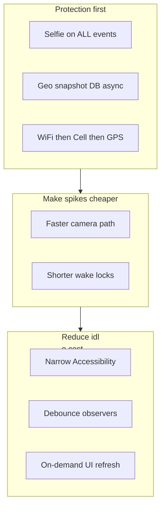

# Battery Optimization Plan (MRP)

**Goal:** Maximize battery life **without reducing protection**. Core security (wrong unlock, USB, SIM SMS, selfies on events, location on alerts, reboot survival) stays fully enabled. Make each spike cheaper—not fewer spikes.

**Principle:** Prefer *event-driven, short, bounded* work over continuous polling. Protection and lost-device recoverability are **priority #1**; battery savings come from *how* work runs, not *whether* it runs.

**Location rule (product):** Cellular-primary market — Wi‑Fi when available (cheaper), **mobile/cell is the normal path**, GPS last. Cache before any radio.

**Geo snapshots:** Separate `geo_snapshots` table (10k rows / 180 days local retention) for future lost-device web tracking — async, non-blocking.

**Permissions:** Guided **Grant All Access** flow; Accessibility optional; SMS recovery-only with consent.

**Date:** 2026-07-20 (updated)

---

## Non‑negotiables (must keep working)

| Feature | Must retain |
|---------|-------------|
| Wrong unlock / biometric fail | Device Admin (+ Accessibility if needed) + **selfie** |
| USB connect | FGS receiver + **selfie** |
| SIM change recovery | Detect SIM change → location cascade → SMS to contacts |
| **Selfie on all monitored events** | Wi‑Fi / BT / airplane / mobile data / screen lock / USB / unlock — **ON** (same as today) |
| Location on security / recovery alerts | Capture on those events; GPS as last resort |
| **Lost-device trackability** | Persistent geo history (coords + geofence + address) for future web recovery |
| Monitoring after reboot / OEM kill | Boot start + sticky FGS + battery-optimization exemption UX |
| User-facing Home / Timeline / Gallery | Correct data; map + address when network allows |

---

## Current battery profile (baseline)

Architecture is **always-on foreground service + event-driven work**. No AlarmManager / JobScheduler / WorkManager today.

### Ranked hotspots

1. **Always-on `MrpMonitorService` FGS** (camera \| location types, sticky) — baseline drain  
2. **Screen-on CameraCaptureActivity + Camera2** on events — short high spikes (**keep all triggers; optimize duration**)  
3. **`MrpAccessibilityService` with broad event mask** — continuous overhead when enabled  
4. **Per-event high-accuracy GPS + geocode** (legacy) — **mitigated by Wi‑Fi→cell→GPS cascade (Layer A done)**  
5. **SIM recovery GNSS** — capped **10–15s**, cascade before GPS  
6. **ContentObserver on all Global/Secure settings** → burst re-evals  
7. **NetworkCallback + multi delayed re-evals** (0.5–2.5s × N) on connectivity churn  
8. **15s wake locks** on photo / SIM paths  
9. ~~Home 15s / Gallery polls~~ — **DONE (Phase 1.1):** focus / AppState / pull-to-refresh only  

Key files:
- `android/.../service/MrpMonitorService.kt`
- `android/.../service/MrpAccessibilityService.kt`
- `android/.../service/CameraCaptureActivity.kt`
- `android/.../domain/usecase/LocationResolver.kt` *(Wi‑Fi→cell→GPS cascade)*
- `android/.../domain/usecase/LocationHelper.kt`
- `android/.../domain/usecase/TimelineEventLogger.kt`
- `android/.../domain/usecase/SimRecoveryUseCases.kt`
- `android/.../data/local/DatabaseHelper.kt` *(geo snapshot table — planned)*
- `android/.../util/OemBatteryMitigation.kt`
- `src/features/home/HomeScreen.tsx`

---

## Strategy layers

| Layer | Action | Status / impact |
|-------|--------|-----------------|
| A — Location stack | Wi‑Fi→cell→GPS cascade + shared cache + geocode rate-limit | **Done** |
| A2 — Geo snapshot store | Separate async SQLite table for lost-device tracking (web sync later) | **Done** |
| B — Idle / wake | Cap wake locks 3–5s; debounce observers | Pending |
| C — Camera **optimization** | Faster capture, shorter screen-on, single pipeline — **selfies stay ON for all events** | Pending |
| D — FGS / Accessibility | Narrow a11y mask; lean FGS types when safe | Pending |
| E — User mode | Optional “Battery saver” that **never** disables selfies or SIM SMS | Pending |

**Removed / rejected:** Turning selfies OFF for Wi‑Fi / BT / airplane / mobile-data toggles.

---

## Phase 0 — Measure (1–2 days)

1. **Instrument battery telemetry (local)**  
   - Logcat tag **`MrpBattery`**: location tier, cache hit, duration ms, provider, geocode network.  
   - Add later: wake-lock hold ms, camera duration, geo_snapshot write ms.  
2. **Baseline on Pixel**  
   - 8h overnight with monitoring ON.  
   - 1h mixed: Wi‑Fi toggles, unlock fails, Home open.  
   - Note Android Settings → Battery → MRP %.  
3. **Feature checklist:** wrong PIN, USB, SIM Test SMS, **selfie on Wi‑Fi toggle**, Home location + map, Timeline events.

**Exit:** Baseline numbers + checklist green.

---

## Phase 1 — Quick wins (low risk, high ROI)

### 1.1 UI polling (JS) — **DONE**

| Screen | Status |
|--------|--------|
| Home | Focus / AppState active / pull-to-refresh — no interval |
| Gallery / Timeline | Focus / AppState active / pull-to-refresh |
| Monitoring permissions | AppState / focus re-check — no 5s interval |

### 1.2 Wake locks

- Cap event wake lock at **3–5s** (today 15s); release as soon as camera session ends.  
- Remove redundant `ACQUIRE_CAUSES_WAKEUP` where `CameraCaptureActivity` already turns screen on.  
- Never hold wake lock across GNSS waits — rely on FGS.

### 1.3 Debounce ContentObserver / NetworkCallback

- Coalesce `evaluateAllToggles` to **one** run within **2–3s**.  
- Ignore rapid duplicate airplane/Wi‑Fi intents within **1–2s**.  
- App-usage track: ≤ every **15–30 min**, or only when screen on.

### 1.4 Battery optimization exemption UX

- Wire `OemBatteryMitigation` into Monitoring / Permissions.  
- Prompt once: “Allow unrestricted battery” + OEM autostart deep links.

---

## Phase 2 — Location policy (Wi‑Fi → Cell → GPS)

**Goal:** Same protection quality, cheaper fixes. GPS is last resort—not removed.

### How tiers map to Android

| Priority | Intent | Mechanism | Battery |
|----------|--------|-----------|---------|
| 0 | Cache | Process-wide last good fix if age &lt; 90s | Free |
| 1 | Wi‑Fi | Fused `PRIORITY_LOW_POWER` while Wi‑Fi connected | Lowest |
| 2 | Mobile / cell | Fused `PRIORITY_BALANCED_POWER_ACCURACY` while cellular available | Low–medium |
| 3 | GPS | Fused `PRIORITY_HIGH_ACCURACY` / GPS_PROVIDER, capped | Highest |

### 2.1 Severity → cascade depth

| Event class | Policy |
|-------------|--------|
| Informational (screen lock, Wi‑Fi toggle, etc.) | Cache → Wi‑Fi → cell → last-known; **never force GPS** on routine rows |
| UI (Home current location) | Cache → Wi‑Fi → cell → **short GPS if still no fix** (user may be tracking lost device) |
| Security (wrong unlock, USB) | Full cascade; GPS if Wi‑Fi+cell failed or fix older than ~2 min |
| SIM recovery | Cascade first; GPS hard cap **10–15s**; **always send SMS** even on NoFix |

Shared API: `LocationResolver.resolve(severity)`.

### 2.2 Shared location cache

- Process-wide cache: last good fix + timestamp + tier.  
- All callers read cache first if age &lt; 90s.  
- Reverse geocode: prefer Wi‑Fi; allow cellular with rate-limit (60s); offline → coords label.

### 2.3 Home live map & tracking UX (**protection priority**)

**Product rule:** If the phone is lost, Home and the geo store must give the owner something useful to find it—not a degraded “Wi‑Fi only” experience.

| Resource | Wi‑Fi | Mobile data | GPS | Offline |
|----------|-------|-------------|-----|---------|
| **Coordinates** | Network fix | Network fix | Last resort (UI/security) | Last-known / cache |
| **Address** | Geocode | Geocode (rate-limited) | N/A | Coords label |
| **Map preview tile** | Fetch | **Fetch** (cache 10 min per coords) | N/A — tiles are HTTP, not GPS | Coords + “Tap Google Maps” |

- Map tile cascade: **Wi‑Fi → mobile data → offline fallback** (revert strict Wi‑Fi-only UI gate).  
- Cache one static tile per rounded lat/lng (~10 min) to avoid refresh storms on cellular.  
- “Tap open Google Maps” always available.  
- No continuous live-follow map animation by default (battery); **do** refresh on Home focus / pull-to-refresh.

**Risk:** Low–medium. **Impact:** High for lost-device UX.

---

## Phase 2.5 — Geo snapshot store (new, async, non-blocking)

**Purpose:** A **separately identified** SQLite table for location + geofence + address history, optimized for future **web app lost-device tracking**. Does **not** replace Timeline JSON / `events` table or change existing UI behavior.

### Design principles

1. **Write-only side channel** — append after location resolves; never block event logging or selfie path.  
2. **Async on IO dispatcher** — `GeoSnapshotWriter.enqueue(...)` fire-and-forget.  
3. **Same LocationResolver output** — reuse tier, provider, accuracy; no second GPS pass.  
4. **Sync-ready** — `SyncStatus = PENDING` for later web pull (out of scope until web plan).  
5. **Retention** — cap rows (e.g. 5 000) or age (e.g. 90 days); prune on insert.

### Proposed table: `geo_snapshots`

| Column | Type | Notes |
|--------|------|-------|
| `Id` | INTEGER PK | Auto |
| `DeviceId` | TEXT | ANDROID_ID or app device id |
| `CapturedAtMs` | INTEGER | Wall clock |
| `Latitude` / `Longitude` | REAL | Required |
| `AccuracyM` | REAL | From fix |
| `AltitudeM` | REAL | Optional |
| `Provider` | TEXT | fused / gps / network |
| `LocationTier` | TEXT | cache / wifi / cell / gps / last_known |
| `DetailedAddress` | TEXT | Geocoded or null |
| `InsideGeofence` | INTEGER | 0/1 |
| `GeofenceId` | TEXT | Nullable |
| `TriggerSource` | TEXT | e.g. `WRONG_PASSWORD`, `WIFI_ENABLED`, `HOME_UI`, `SIM_RECOVERY` |
| `TriggerReferenceId` | TEXT | Optional link to timeline event / photo |
| `BatteryPct` | INTEGER | Snapshot at capture |
| `NetworkType` | TEXT | wifi / cell / offline |
| `SyncStatus` | TEXT | PENDING / SYNCED |
| `JsonMeta` | TEXT | Optional extras (cache_hit, duration_ms) |

**DB migration:** `DatabaseHelper` v2 — add table only; do not drop `events` / `app_usage`.

### Hook points (after Layer A, no behavior change)

| Source | When to enqueue |
|--------|-----------------|
| `TimelineEventLogger` | After `LocationResolver.resolveSync` succeeds (or last-known) |
| `SimChangeRecoveryAlertUseCase` | After GNSS capture |
| Home `getCurrentLocationWithAddress` | On successful UI resolve (user opened Home) |
| Security events | Always (wrong unlock, USB) |

**Not in scope yet:** Background periodic GPS polling, cloud upload, web UI.

### Future web app (placeholder)

When web plan is ready: sync `geo_snapshots WHERE SyncStatus=PENDING` → show trail on map, last-known pin, geofence enter/exit history. Mobile app unchanged except optional sync worker.

---

## Phase 3 — Camera optimization (**keep all selfies ON**)

**Rejected:** Disabling selfies for Wi‑Fi / BT / airplane / mobile-data toggles.

**Allowed optimizations (same functionality, less battery per capture):**

| Optimization | Detail |
|--------------|--------|
| Shorter capture timeout | Target **3–4s** failsafe (today up to ~10s) |
| Single capture pipeline | One path: `CameraCaptureActivity` **or** in-service Camera2—not both when possible |
| Release wake lock on first frame | Don’t hold 15s if JPEG written at 1s |
| Skip duplicate burst | If same event type debounced within 1s, skip **second** camera open only if photo already taken (keep first selfie) |
| Lower preview resolution where OEM allows | Same evidence quality threshold |

| Trigger | Selfie |
|---------|--------|
| Wrong unlock / biometric fail | **ON** |
| USB | **ON** |
| SIM change | **ON** |
| Wi‑Fi / BT / Airplane / Hotspot / Mobile data | **ON** (unchanged) |
| Screen lock / unlock | **ON** (unchanged) |

---

## Phase 4 — Accessibility & FGS lean-up

- Narrow Accessibility event types where safe; increase `notificationTimeout`.  
- Request only FGS types needed at runtime.  
- Optional modes: **Maximum protection** (default) / Battery saver — saver may reduce **GPS timeout** or **geo snapshot frequency**, but **never** disables selfies, SIM SMS, or wrong-unlock path.

---

## Phase 5 — Structural (optional, later)

Split FGS, WorkManager for geo snapshot **sync only** (not location acquisition), exact alarms only if OEM kills FGS.

---

## Testing plan (every phase)

1. **Functional:** wrong PIN, biometric fail, USB, Wi‑Fi toggle → **selfie + timeline + geo_snapshot row**, SIM Test SMS, reboot → monitoring resumes.  
2. **Lost-device:** Home shows map on Wi‑Fi **and** cellular; geo_snapshots query returns latest pin.  
3. **Battery:** 8h idle; `MrpBattery` shows `cache`/`wifi`/`cell` dominating over `gps` for routine events.  
4. **Regression:** Gallery thumbs, Timeline addresses, no delay on event path from async geo write.

---

## Suggested rollout order

| Sprint | Scope | Expected win |
|--------|-------|--------------|
| A | Phase 2 location cascade | **Done** — GPS energy ↓ |
| B | Phase 2.5 geo_snapshots + Home map Wi‑Fi→cell | Lost-device trail + full map UX |
| C | Phase 1.2–1.4 wake / debounce | Fewer wake storms |
| D | Phase 3 camera **optimization** (not disable) | Shorter screen-on per selfie |
| E | Phase 4 a11y / FGS lean-up | Overnight idle ↓ |
| F | Web sync (when plan ready) | Remote tracking |

---

## Explicit non-goals

- Removing the foreground service while claiming always-on monitoring  
- Stopping BootReceiver / sticky restart  
- Disabling Device Admin for wrong unlock  
- Skipping SMS on SIM change  
- **Disabling selfies on any monitored event type**  
- **High-rate continuous GPS streaming** (1 Hz track) — event-driven + geo snapshots instead  

---

## Success metrics

- Security checklist **100% pass** on Pixel (including selfie on Wi‑Fi toggle)  
- `geo_snapshots` receives a row on every location-backed event without adding &gt;50ms to event path  
- Home map visible on **Wi‑Fi and mobile data**  
- Routine events: `tier=cache|wifi|cell` in majority of `MrpBattery` logs  
- GPS mainly on security / SIM / Home-no-fix fallback  
- Idle overnight MRP battery share ↓ **≥ 30–50%** vs legacy HIGH_ACCURACY-per-event baseline  

---

## Implementation notes for agents

1. Change one hotspot per PR; keep the feature checklist in the PR body.  
2. **Never remove selfies or tracking capability to save battery**—optimize duration and async side effects only.  
3. Geo snapshot writes must be **async** and must not alter Timeline / Gallery behavior.  
4. Revert Home `allowMapTiles={wifi only}` → network cascade with tile cache.  
5. After code changes, run `graphify update .` if `graphify-out/` exists.  
6. Log location decisions with tag `MrpBattery`.
