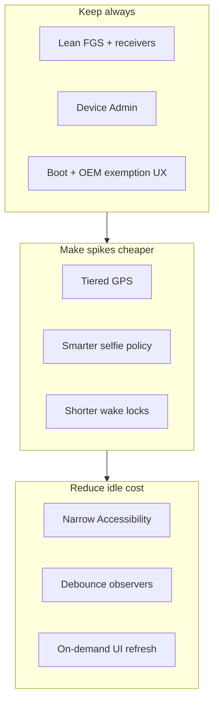

# Battery Optimization Plan (MRP)

**Goal:** Maximize battery life without breaking core security features (wrong unlock, USB, SIM change recovery + SMS, GPS-on-alert, monitoring survival across reboot/OEM kill).

**Principle:** Prefer *event-driven, short, bounded* work over continuous polling. Keep the always-on monitor lean; make spikes cheaper and rarer; never remove a required detection path—only make it cheaper.

**Date:** 2026-07-19

---

## Non‑negotiables (must keep working)

| Feature | Must retain |
|---------|-------------|
| Wrong unlock / biometric fail | Device Admin (+ Accessibility if needed for biometrics) + selfie path |
| USB connect | FGS receiver + optional selfie |
| SIM change recovery | Detect SIM change → offline GNSS → SMS to contacts |
| GPS on security / recovery alerts | Location capture on those events (not continuous track) |
| Monitoring after reboot / OEM kill | Boot start + sticky FGS + battery-optimization exemption UX |
| User-facing Home / Timeline / Gallery | Correct data; refresh can be slower / on-demand |

---

## Current battery profile (baseline)

Architecture is **always-on foreground service + event-driven work**. No AlarmManager / JobScheduler / WorkManager today.

### Ranked hotspots

1. **Always-on `MrpMonitorService` FGS** (camera \| location types, sticky) — baseline drain  
2. **Screen-on CameraCaptureActivity + Camera2** on many events (Wi‑Fi/BT/airplane/USB/SIM/unlock) — short high spikes  
3. **`MrpAccessibilityService` with broad event mask** — continuous overhead when enabled  
4. **Per-event high-accuracy GPS + geocode** on nearly every timeline log  
5. **SIM recovery GNSS up to ~30s** high accuracy (rare, heavy)  
6. **Home `setInterval` 15s + live GPS** while Home is open  
7. **ContentObserver on all Global/Secure settings** → burst re-evals  
8. **NetworkCallback + multi delayed re-evals** (0.5–2.5s × N) on connectivity churn  
9. **15s wake locks** on photo / SIM paths  
10. **Aggressive JS polls** (2.5–5s) on Gallery / Timeline when open  

Key files:
- `android/.../service/MrpMonitorService.kt`
- `android/.../service/MrpAccessibilityService.kt`
- `android/.../service/CameraCaptureActivity.kt`
- `android/.../domain/usecase/LocationHelper.kt`
- `android/.../domain/usecase/TimelineEventLogger.kt`
- `android/.../domain/usecase/SimRecoveryUseCases.kt` (`CaptureOfflineGnssUseCase`)
- `android/.../util/OemBatteryMitigation.kt`
- `src/features/home/HomeScreen.tsx`

---

## Strategy layers

---

## Phase 0 — Measure (1–2 days)

**Do before large changes** so we prove savings and catch regressions.

1. **Instrument battery telemetry (local)**  
   - Log per event: wake-lock hold ms, GPS duration/provider, camera duration, FGS uptime.  
   - Expose optional debug screen or logcat tags: `MrpBattery`.  
2. **Baseline on Pixel**  
   - 8h overnight with monitoring ON, no interaction.  
   - 1h mixed: Wi‑Fi toggles, unlock fails, Home open.  
   - Note Android Settings → Battery → MRP %.  
3. **Feature checklist** (automate later): wrong PIN, USB, SIM recovery Test SMS, Home location, Timeline events.

**Exit:** Baseline numbers + checklist green.

---

## Phase 1 — Quick wins (low risk, high ROI)

### 1.1 UI polling (JS) — no feature loss

| Screen | Today | Target |
|--------|-------|--------|
| Home | 15s full reload + GPS | **On focus / AppState active / pull-to-refresh** (no interval) |
| Gallery / Timeline | 2.5–5s | **On focus / AppState active / pull-to-refresh** (no interval) |
| Accessibility check on Monitoring | 5s | On focus / AppState active only |

**Risk:** Low. **Impact:** Medium when UI is open.

### 1.2 Wake locks

- Cap event wake lock at **3–5s** (today 15s); release as soon as camera session ends.  
- Remove `ACQUIRE_CAUSES_WAKEUP` from partial wake lock where `CameraCaptureActivity` already turns screen on (avoid double wake semantics).  
- Never hold wake lock across GNSS 30s waits — use wake lock only for the critical send window after fix, or rely on FGS.

**Risk:** Low–medium (must verify selfie still works screen-off). **Impact:** Medium.

### 1.3 Debounce ContentObserver / NetworkCallback

- Coalesce `evaluateAllToggles` to **one** run within **2–3s** (single `postDelayed`, cancel previous).  
- Ignore rapid duplicate airplane/Wi‑Fi intents within **1–2s**.  
- App-usage track: keep ≤ every **15–30 min**, or only when screen on.

**Risk:** Low. **Impact:** Medium on flaky networks / toggle spam.

### 1.4 Battery optimization exemption UX

- Wire `OemBatteryMitigation` into Monitoring / Permissions (today native-only, FGS only logs).  
- Prompt once: “Allow unrestricted battery” + OEM autostart deep links.  
- **Does not drain battery** — prevents OEM from killing FGS (reliability).

**Risk:** Low. **Impact:** Reliability ↑; may slightly increase drain vs killed state (acceptable for security app).

---

## Phase 2 — Location policy (tiered GPS)

**Goal:** Same alerts, cheaper fixes.

### 2.1 Event severity → location tier

| Event class | Location policy |
|-------------|-----------------|
| Informational (e.g. screen lock, Wi‑Fi on/off if selfie disabled) | Last-known / balanced / skip geocode |
| Security (wrong unlock, USB, SIM) | Balanced first; high accuracy only if stale (&gt;60–120s) or missing |
| SIM recovery alert | Keep offline GNSS but: fused balanced → last known → GPS only if needed; **cap 10–15s** (today up to 30s); always still send SMS even if NoFix |

### 2.2 Shared location cache

- Process-wide cache: last good fix + timestamp.  
- `TimelineEventLogger` / `LocationHelper` / SIM GNSS read cache first if age &lt; 60–90s.  
- Reverse geocode: async, rate-limit (e.g. 1 / 30s), or skip when offline / duplicate coords.

### 2.3 Home live map

- Default: last cached fix + “Refresh location” button.  
- Optional “Live follow” mode: 15–30s interval only while enabled and screen on.

**Risk:** Medium (verify address quality on events). **Impact:** High.

---

## Phase 3 — Selfie / camera policy (keep security, cut spam)

**Goal:** Keep intrusion evidence; stop waking for low-value toggles by default.

### 3.1 Default capture matrix

| Trigger | Default selfie | User toggle (already exist-ish) |
|---------|----------------|----------------------------------|
| Wrong unlock / biometric fail | ON | Keep |
| USB | ON | Keep |
| SIM change | ON (or photo optional; SMS is critical) | Keep |
| Wi‑Fi / BT / Airplane / Hotspot / Mobile data | **OFF by default** | User can enable |

Settings already have per-trigger flags — ensure defaults favor battery and UI copy explains cost.

### 3.2 Camera path efficiency

- Prefer single capture path (Activity **or** in-service Camera2, not both waking).  
- Failsafe finish tighter (e.g. 3–4s).  
- Skip camera if permission/overlay missing (log only) to avoid failed wake loops.  
- Optional: capture at lower resolution for non-critical events.

**Risk:** Medium (product decision on defaults). **Impact:** High on chatty networks.

---

## Phase 4 — Accessibility & FGS lean-up

### 4.1 Accessibility

- Narrow event types to packages/windows needed for biometric fail (not `TYPES_ALL_MASK` forever).  
- Increase `notificationTimeout` / filter duplicate events.  
- If Device Admin covers PIN failures adequately on target OEMs, make Accessibility **recommended** not mandatory; document Pixel vs Samsung gaps.

### 4.2 FGS types & notification

- Request only FGS types actually needed at runtime (avoid advertising camera+location when idle).  
- Keep low-importance ongoing notification (required).  
- Optional: pause “heavy” subsystems when screen off for N minutes **except** unlock/USB/SIM receivers (receivers stay registered).

### 4.3 Optional “Battery saver monitoring” mode

User-facing profile (does not remove features—softens them):

| Mode | Behavior |
|------|----------|
| **Maximum protection** (default today) | Current behavior |
| **Balanced** (new default candidate) | Phase 1–3 policies |
| **Battery saver** | Selfie only wrong-unlock + USB + SIM; GPS balanced/cached; no Home live GPS; Accessibility off if Admin OK |

All modes must still: detect SIM change, send SMS, log wrong unlock, survive reboot.

**Risk:** Medium–high for Accessibility narrowing (OEM testing). **Impact:** High.

---

## Phase 5 — Structural (optional, later)

Only if Phases 1–4 insufficient:

1. **Split FGS responsibilities** — lightweight “sensor” FGS vs short-lived camera/location work via `startForegroundService` only when capturing.  
2. **WorkManager** for deferred non-security sync (pending Drive sync later)—never for unlock/SIM.  
3. **Exact alarms** only for rare health pings if OEM kills FGS (careful with Android 12+ quotas).  
4. True **BatteryUsageStats** (where permitted) instead of foreground-time proxy in `getMrpBatteryUsage`.

---

## Testing plan (every phase)

1. **Functional:** wrong PIN, biometric fail, USB, Wi‑Fi toggle (with setting on/off), SIM recovery Test SMS, reboot → monitoring resumes.  
2. **Battery:** 8h idle monitoring ON; compare MRP % and wakeups (`adb shell dumpsys batterystats`).  
3. **Doze / App Standby:** force doze; confirm SIM/USB/unlock still fire when possible; exemption path works.  
4. **OEM:** at least Pixel + one aggressive OEM (Xiaomi/Samsung) for autostart + selfie-from-lock.  
5. **Regression:** Home map, Timeline addresses, Gallery after capture.

---

## Suggested rollout order

| Sprint | Scope | Expected win |
|--------|-------|--------------|
| A | Phase 0 + 1 (UI polls, wake lock, debounce, exemption UX) | Noticeable when using app; fewer wake storms |
| B | Phase 2 (tiered GPS + cache) | Large drop in GPS energy |
| C | Phase 3 (selfie defaults + camera path) | Fewer screen-on spikes |
| D | Phase 4 (Accessibility + Balanced mode) | Best idle drain |

---

## Explicit non-goals (would break the product)

- Removing the foreground service entirely while claiming always-on monitoring  
- Stopping BootReceiver / sticky restart  
- Disabling Device Admin detection for wrong unlock  
- Skipping SMS on SIM change to “save battery”  
- Continuous background GPS “optimization” that is actually a permanent high-accuracy stream  

---

## Success metrics

- Idle overnight MRP battery share ↓ **≥ 30–50%** vs baseline (Balanced mode)  
- Security checklist **100% pass** on Pixel  
- SIM Test SMS still delivers with GPS NoFix fallback  
- No increase in “monitoring stopped” reports after OEM kill (exemption UX adopted)  

---

## Implementation notes for agents

1. Change one hotspot per PR; keep the feature checklist in the PR body.  
2. Prefer defaults that save battery; keep “Maximum protection” available.  
3. After code changes, run `graphify update .` if `graphify-out/` exists.  
4. Do not add continuous location tracking under the guise of optimization.
