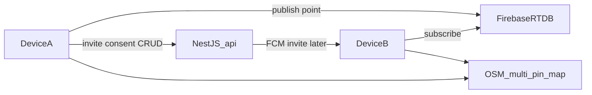

# Circle live share (P4) — architecture

## Decision (NestJS + Firebase)

| Concern | System | Why |
|---|---|---|
| Ephemeral live points (lat/lng, TTL) | **Firebase Realtime Database** | Low-latency fan-out; no Nest hop; matches “no server location history” (TTL delete) |
| Circle CRUD, invite, consent, member caps | **NestJS** (`api/`) | AuthZ, audit, Family invites later; app uses `CircleDirectoryPort` |
| Push invites / Panic → Circle | **FCM via NestJS** when API is up | Server holds FCM tokens; until then: share invite code |
| Map UI | **OSM / Yandex static** multi-pin | Same pattern as Home; colored pin per member |

## RTDB path

`circle_live/{circleId}/{firebaseUid}` → `{ lat, lng, atMs, shareOn, displayName, colorIndex }`

TTL: clients delete own node on Share OFF; Nest/Cloud Function may purge `atMs` older than 15m (P4-14).

## Rules (enable in Firebase Console)

See [`api/firebase/database.rules.json`](api/firebase/database.rules.json) — write only own uid; read if authenticated.

## App ports

- `LiveRelayPort` → Firebase (native) when signed in; else local stub (same device only)
- `CircleDirectoryPort` → NestJS when `MRP_API_BASE_URL` set; else local Async prefs (current)

## What you must enable once

1. Firebase Console → Realtime Database → create DB (if needed).  
   Default URL used by the app (from `MRP/.env` → `PUBLIC_FIREBASE_DATABASE_URL`):  
   `https://mobileresilienceplatform-default-rtdb.firebaseio.com`  
   If Firebase shows a different regional URL, put that exact value in `MRP/.env`.
2. Paste / deploy rules from [`api/firebase/database.rules.json`](../api/firebase/database.rules.json):
   - Console: Realtime Database → Rules → paste JSON → Publish  
   - Or CLI (from `api/`): `firebase deploy --only database --project mobileresilienceplatform`
3. Both test devices: Hub → Account → Google Sign-In  
4. Enterprise hardcoded on both  
5. Second device: Join with invite code after create on device A  

Gradle injects `PUBLIC_FIREBASE_DATABASE_URL` from `MRP/.env` into `R.string.firebase_database_url` at build time. NestJS loads the same `.env` via dotenv.