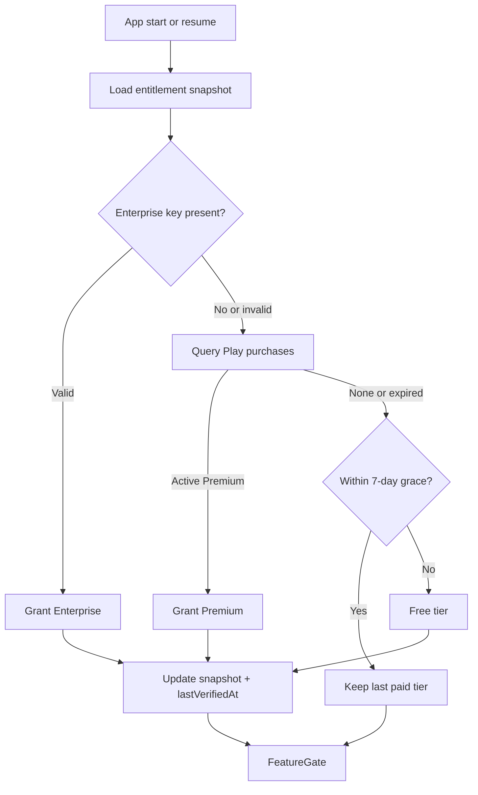
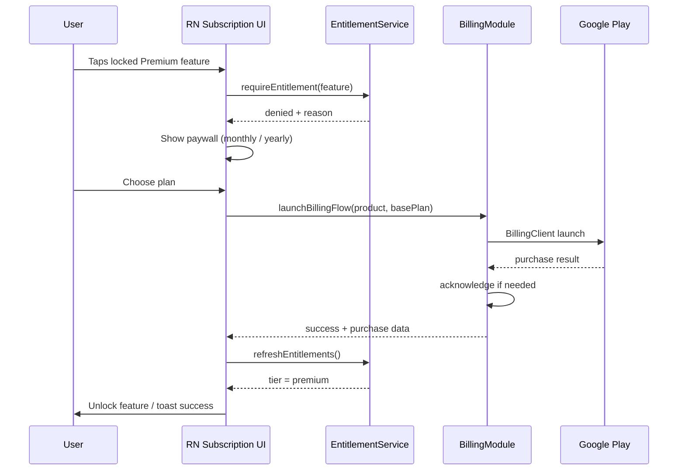
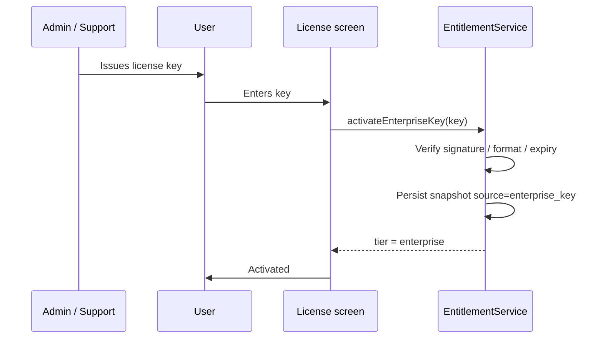

# MRP Subscription Plan

> **Status:** Documentation only — not implemented yet.  
> **Audience:** Product + engineering when monetization work starts.  
> **Related:** [PROJECT_IMPLEMENTATION_PLAN.md](../PROJECT_IMPLEMENTATION_PLAN.md) (master plan + test plans), [Architecture.md](Architecture.md), [BUGS_AND_MISSING_FEATURES.md](BUGS_AND_MISSING_FEATURES.md) §30.

---

## 1. Goals and constraints

### Goals

- Monetize high-value protection features (SIM recovery, deep history, future geofence/cloud).
- Keep Free useful for adoption: local PIN vault, basic monitoring, limited evidence.
- Preserve MRP’s privacy positioning: **on-device vault, no MRP account, no silent cloud upload**.

### Constraints

| Constraint | Implication |
|---|---|
| No MRP cloud account today | Entitlements bind to **Google Play purchase** + local encrypted cache, not an MRP user ID |
| Android-first | v1 = Google Play Billing only; iOS StoreKit deferred |
| Architecture.md | Free / Premium / Enterprise; validate on startup and before premium features; offline grace |
| Existing native patterns | Billing bridge mirrors `PinLockModule` / `MrpNativeModule`; cache in EncryptedSharedPreferences |

### Non-goals (v1)

- MRP backend receipt validation server
- RevenueCat (revisit only if multi-store or server-side validation becomes required)
- Changing Free core monitoring into a paywall-only product

---

## 2. Tiers and pricing

### Tiers

| Tier | How obtained | Billing |
|---|---|---|
| **Free** | Default | None |
| **Premium** | In-app purchase | Auto-renewing Google Play subscription |
| **Family** | In-app purchase (owner) | `mrp_premium_family` — up to **6 members** |
| **Enterprise** | Play IAP and/or admin grant | `mrp_enterprise` — **Circle live share** + fleet/admin |

### Play product IDs (proposed)

| SKU | Base plan | Notes |
|---|---|---|
| `mrp_premium` | `monthly` / `yearly` | Individual Premium |
| `mrp_premium_family` | `monthly` / `yearly` | Family owner; members via invite |
| `mrp_enterprise` | `monthly` / `yearly` | **Circle** (all categories) + web live + admin features |

Exact list price is set in Play Console (localized). Placeholders for planning:

| Plan | Placeholder (USD) | Placeholder (INR) |
|---|---|---|
| Premium monthly | $4.99 | ₹399 |
| Premium yearly | $39.99 | ₹2,999 |

Enterprise: custom quote; key issued manually until an admin portal exists.

---

## 3. Feature matrix and caps

Concrete caps so implementers can gate without inventing numbers later.

| Capability | Free | Premium / Family | Enterprise |
|---|---|---|---|
| Local PIN lock / vault | Yes | Yes | Yes |
| Background monitoring (unlock, USB, network, SIM events) | Yes | Yes | Yes |
| Security timeline | Last **7 days** | Last **90 days** | Custom (default **365 days**) |
| Intruder selfies stored | Max **20** photos | Max **500** photos | Unlimited / policy |
| Photo auto-delete | Forced ≤ **7 days** | User up to **90 days** | Custom retention |
| SIM recovery contacts | **1** contact (trial) | Up to **5** contacts | Up to **20** + policy |
| SIM change recovery SMS | Enabled with 1 contact | Full | Full + templates/policy |
| App Usage dashboard | Today + **7-day** history | Full history in retention | Full + export |
| App Safety (on-device heuristics) | Basic flags | Full rules / history | Full + export |
| Reports / CSV export | No | Yes | Yes |
| **Circle live share** (all categories) | No | **No** | **Yes** |
| Geofencing (when built) | No | Yes | Yes |
| Push event alerts (when built) | No | Yes | Yes |
| Cloud sync / multi-device (Drive) | No | **Premium** (included) | Yes + fleet |
| Fleet / device admin / SLA | No | No | Yes |
| Priority support | No | Email | Dedicated |

### Feature keys (for `requireEntitlement`)

Use stable string IDs in code later:

```
timeline.retention.extended
photos.storage.full
photos.retention.custom
sim.contacts.multi
sim.sms.full
appusage.history.full
appusage.export
appsafety.full
reports.export
geofence
push.alerts
cloud.sync
circle.one_to_one
circle.friend
circle.friends_group
circle.family
circle.peer
circle.live.web
enterprise.fleet
```

Free may use limited variants of some features; gates enforce caps, not only boolean unlocks.

---

## 4. Entitlement model

### Snapshot (local source of truth for UX)

Stored in **EncryptedSharedPreferences** (same trust boundary as PIN hash):

```json
{
  "tier": "free | premium | family | enterprise",
  "source": "none | play | family | enterprise_key | admin",
  "productId": "mrp_premium | null",
  "basePlanId": "monthly | yearly | null",
  "expiryEpochMs": 0,
  "lastVerifiedAtEpochMs": 0,
  "graceUntilEpochMs": 0,
  "enterpriseKeyId": "optional opaque id",
  "purchaseTokenHash": "optional non-reversible fingerprint for support"
}
```

- **Authoritative when online:** Play Billing `queryProductDetails` + `queryPurchasesAsync` (or successor APIs).
- **Authoritative for Enterprise:** local key validation (HMAC/signature or signed JWT from issuer); optional online revoke later.
- **Offline grace:** **7 days** after `lastVerifiedAt` while last known paid tier was active. After grace → soft-lock premium features; Free features continue.

### Resolution order



### Validation points (from Architecture.md)

1. **On startup / resume** — refresh tier before main UI relies on gated state.
2. **Before premium action** — e.g. adding 2nd SIM contact, opening export, raising retention beyond Free caps.
3. **After purchase / restore / license activate** — immediate re-resolve.

---

## 5. User flows

### 5.1 Discover → paywall → purchase → unlock



### 5.2 Restore purchases

- Entry: Subscription screen → **Restore**.
- Same Google account that purchased; after reinstall, `queryPurchasesAsync` rebuilds snapshot.
- If nothing found → clear message; do not imply MRP account restore.

### 5.3 Renew / expire / grace → downgrade

| Event | App behavior |
|---|---|
| Auto-renew success | Next verify extends `expiryEpochMs`; tier stays Premium |
| User cancels in Play Store | Remains Premium until period end, then Free (no grace if verify confirms expired and not in Play account hold) |
| Temporary offline after paid verify | Soft Premium until `graceUntilEpochMs` |
| Grace elapsed + still unverified / expired | Downgrade to Free; enforce Free caps (may hide/export-limit excess data, do not delete evidence without user notice) |

**Cap enforcement on downgrade:** Prefer soft limits (cannot add new photos beyond Free max; oldest Free window still visible) over silent deletion. Document any purge in UI if Free retention is shorter than stored Premium data.

### 5.4 Cancel via Play Store

- Cancellation is managed in Play subscriptions UI.
- App reflects on next entitlement refresh (startup, resume, manual restore, or periodic verify when online).

### 5.5 Enterprise license activate



- Revocation (v1): expiry embedded in key, or local wipe via support instructions.
- Online revoke list deferred until a backend exists.

### 5.6 Offline launch during grace

1. Load cache → last tier Premium/Enterprise, `now < graceUntilEpochMs`.
2. Skip hard fail if Play unreachable.
3. Show subtle “Offline — subscription status will refresh when online” if desired.
4. After grace + still offline/unverified → Free gates apply.

---

## 6. Technical implementation blueprint

### 6.1 Module layout (to create when implementing)

```
MRP/src/features/subscription/
  SubscriptionScreen.tsx      # Plans, restore, manage, license entry
  PaywallModal.tsx            # Triggered by gate denial
  PlanComparison.tsx          # Free vs Premium vs Enterprise summary

MRP/src/services/entitlements/
  EntitlementTypes.ts
  EntitlementStore.ts         # RN-facing API over native storage
  FeatureGate.ts              # requireEntitlement / canUse / getCaps
  EntitlementProvider.tsx     # Context for UI

MRP/android/.../billing/
  BillingModule.kt            # RN bridge
  PlayBillingClient.kt        # BillingClient wrapper
  EntitlementCache.kt         # EncryptedSharedPreferences snapshot
  EnterpriseLicense.kt        # Key verify + activate
```

### 6.2 Native bridge surface (sketch)

```
getEntitlementSnapshot(): Promise<EntitlementSnapshot>
refreshEntitlements(): Promise<EntitlementSnapshot>
getProductOffers(): Promise<ProductOffer[]>
purchase(productId, basePlanId): Promise<PurchaseResult>
restorePurchases(): Promise<EntitlementSnapshot>
activateEnterpriseKey(key: string): Promise<EntitlementSnapshot>
openPlaySubscriptionManagement(): Promise<void>
```

### 6.3 RN integration points (existing surfaces)

| Surface | Gate / UX |
|---|---|
| [HomeScreen.tsx](src/features/home/HomeScreen.tsx) | Optional plan badge / upgrade CTA |
| [AboutScreen.tsx](src/screens/AboutScreen.tsx) | Plan status + link to Subscription |
| SIM Recovery panel | Cap contacts; paywall on 2nd+ contact |
| App Usage / Reports | History depth + export |
| Monitoring / Photos | Retention + selfie count |
| Future geofence / cloud / push | Boolean Premium+ |

### 6.4 Play Console checklist

- [ ] Create subscription product `mrp_premium` with monthly + yearly base plans
- [ ] Configure free trial / intro offer if desired (optional; default **no trial** for v1 simplicity)
- [ ] Add license testers
- [ ] Ensure purchases are **acknowledged** within Play’s required window
- [ ] Test cancel, renew, and restore on real device
- [ ] Privacy policy / subscriptions disclosure URLs as required by Play

### 6.5 Dependencies (when implementing)

- Android: `com.android.billingclient:billing-ktx` (current Play Billing Library major)
- RN: no third-party IAP wrapper required if custom bridge is used; optional `react-native-iap` only if team prefers — **default decision: custom Kotlin bridge** to match existing native module style

---

## 7. Privacy and trust

- No MRP account signup for subscriptions.
- Do not upload purchase tokens or PII to MRP servers (none in v1).
- Paywall and About copy must not imply cloud surveillance or that Premium uploads evidence to MRP.
- Enterprise keys: store minimal opaque id + validity; do not log raw keys.
- Align with About: “Your phone is the vault.”

---

## 8. Phased rollout

| Phase | Scope | Exit criteria |
|---|---|---|
| **1 — Caps + UI shell** | Entitlement types, Free caps enforced, paywall UI, mock/native stub returns | QA can exercise gates without real money |
| **2 — Play Billing** | Real BillingClient, purchase, acknowledge, restore, 7-day grace | License tester E2E green |
| **3 — Enterprise** | Key format, activate UI, docs for support issuance | Manual activate/deactivate documented |
| **4 — Future features** | Wire geofence / push / cloud gates when those features ship | Matrix rows go from “when built” to enforced |

Do not ship Phase 2 without Phase 1 Free caps — otherwise Premium has nothing meaningful to unlock.

---

## 9. Test plan outline

### Unit / logic

- [ ] FeatureGate: each feature key vs Free / Premium / Enterprise
- [ ] Cap helpers: contacts, photos, retention days
- [ ] Grace: before / at / after `graceUntilEpochMs`
- [ ] Downgrade soft-cap behavior

### Instrumentation / E2E (Play license testers)

- [ ] Purchase monthly → Premium unlock
- [ ] Purchase yearly → Premium unlock
- [ ] Restore after clear app data / reinstall
- [ ] Cancel in Play → remains Premium until expiry → Free
- [ ] Airplane mode within grace → Premium soft
- [ ] Airplane mode past grace → Free
- [ ] Enterprise key valid / invalid / expired
- [ ] Paywall appears only on gated actions, not on core Free monitoring

---

## 10. Open follow-ups (not blocking this doc)

1. Finalize real USD/INR prices in Play Console.
2. Confirm cloud sync stays **included in Premium** vs Enterprise-only when cloud ships (default in this doc: **Premium included**).
3. Optional intro trial (7-day) — product decision later.
4. RevenueCat or backend receipt validation — only if multi-platform or fraud requires it.
5. iOS StoreKit parity after Android Premium is stable.

---

## 11. Implementation readiness checklist

When starting implementation, work from this list:

1. Add Billing dependency + `BillingModule` stub.
2. Implement `EntitlementCache` + RN `EntitlementProvider`.
3. Enforce Free caps on SIM contacts, photos, timeline retention.
4. Build `SubscriptionScreen` + `PaywallModal`.
5. Wire Play purchase / restore / grace.
6. Add About/Home plan status.
7. Enterprise key path.
8. License-tester QA against §9.

---

*Saved for later implementation. No billing code is part of this document.*
