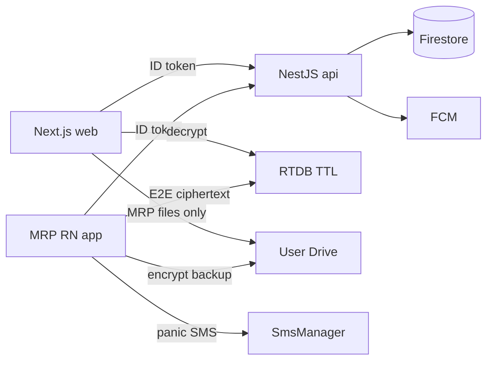

# MRP — Final Project Implementation Plan

> **Status:** Approved architecture & phased roadmap (documentation).  
> **Last updated:** 2026-07-22  
> **Related:** [MRP/SUBSCRIPTION_PLAN.md](MRP/SUBSCRIPTION_PLAN.md), [MRP/Architecture.md](MRP/Architecture.md)

---

## 1. Executive summary

Local device protection (PIN, monitoring, selfies, timeline, SIM recovery, App Usage) is largely shipped. Remaining work delivers **Hub UX, Firebase Auth, NestJS API, Play subscriptions, user-owned Drive sync, Enterprise Circle, web + admin portal** — without MRP storing user vault data.

### Non-negotiable rules

1. **Class A vault** (timeline, selfies, SIM evidence, usage DB) stays on-device; optional sync only to **user Google Drive** (`drive.appdata` / `drive.file` only).
2. **Firebase** holds Auth + subscription/device metadata + Circle control plane — **never vault contents**.
3. **NestJS** (`api/`) owns business logic: entitlements, family, admin, Circle consent, panic orchestration.
4. **Circle = Enterprise subscription only** (5 categories).
5. Architecture uses **swappable ports** so Firebase/NestJS can be replaced later.

### Tabs (locked)

**`Home` · `Security` · `Hub` · `App Usage`**

About → **Hub → About** and **Home → MRP Guide** tile.

---

## 2. Monorepo layout

```
D:\Projects\MRP New\
  MRP/                          # React Native Android app (existing)
  api/                          # NestJS API (new)
  web/                          # Next.js user + admin (new)
  PROJECT_IMPLEMENTATION_PLAN.md
  MRP/.env.example
  api/.env.example
  web/.env.example
```

---

## 3. Stack (free tier)

| Layer | Technology |
|---|---|
| Mobile | RN 0.76, Reanimated 3, Gesture Handler, FlashList, react-native-config |
| Mobile maps | react-native-maps / MapLibre (OSM tiles) |
| API | NestJS + TypeScript + Firebase Admin SDK |
| Web | Next.js App Router, Tailwind, shadcn/ui, Framer Motion, MapLibre |
| Auth | Firebase Auth (Google) |
| Data | Firestore (metadata), RTDB (live ciphertext + TTL) |
| Push | FCM |
| Backup | Google Drive API (scoped) |
| Billing | Google Play Billing |
| Design | Figma or Penpot (free) |

---

## 4. Architecture



### Data classes

| Class | Content | Where | MRP readable? |
|---|---|---|---|
| **A — Vault** | Events, selfies, SIM, usage | Device → optional Drive | **Never** |
| **B — Entitlement** | tier, expiry, family seat | Play + Firestore via NestJS | Tier only |
| **C — Circle** | roster, consent, encrypted live point | Firestore + RTDB TTL | Ciphertext only |

### Firebase collections (thin)

- `users/{uid}` — profile shell (email, dates)
- `subscriptions/{uid}` — tier, expiry, source, ownerUid, seatRole
- `familyPlans/{ownerUid}` — seats, members, invites
- `devices/{uid}/{deviceId}` — label, model, lastSeen, fcmToken
- `circles/{id}` — category, members, roles, consent, interval
- `live/{circleId}/{uid}` — ciphertext, ts, TTL
- `adminUsers/{uid}`, `adminAudit/{id}`

**Never:** timeline, selfies, plaintext location, Drive contents, PIN, recovery code.

### NestJS modules

- `auth` — Firebase JWT guard
- `subscriptions` — mirror Play, family, Enterprise grants
- `circles` — CRUD, consent, categories, invites
- `devices` — registry
- `panic` — FCM to Circle (Enterprise)
- `admin` — users, subs, audit

### Swappable ports (mobile + web)

`EntitlementCloudPort`, `CircleDirectoryPort`, `LiveRelayPort`, `PushPort`, `DriveVaultPort`

---

## 5. Product features

### 5.1 Home — Subscribe + Panic

Row **above** stat tiles (Security score, MRP Guide):

| Button | When | Action |
|---|---|---|
| **Subscribe** | Free / expired | Hub → Subscriptions |
| **Panic** | Always | Hold 2s → panic SMS (like Test SMS) + optional Circle FCM (Enterprise) |

Panic: reuse `sendTestSmsDetailed` pipeline; panic template; timeline `PANIC_ALERT`; rate-limit 3 / 15 min.

### 5.2 Hub menu

Circle · SIM Recovery · Subscriptions · Promotions · Affiliates · About · Drive Sync · Account

### 5.3 Circle — Enterprise only

| Category | Code | Max members |
|---|---|---|
| One to one | `one_to_one` | 2 |
| Friend | `friend` | 2 |
| Friends group | `friends_group` | 10 |
| Family | `family` | 8 |
| Peer | `peer` | 6 |

E2E encrypted live relay; configurable interval 20s–30m; battery-adaptive; mutual consent; no server location history.

### 5.4 Subscription tiers

| Tier | Circle | Highlights |
|---|---|---|
| Free | No | 7-day history, basic monitoring |
| Premium | No | Full history, reports, Drive, SIM multi-contact |
| Family | No | Premium × 6 seats |
| **Enterprise** | **Yes** | All Circle categories + web live + admin fleet |

### 5.5 PIN recovery

Recovery code at setup; Google re-auth reset; Drive restore + code; unrecoverable if none saved (warn at setup).

### 5.6 Multi-device

One Google UID → many `devices`; vault per device; Drive restore same Google; one Play sub per Play account.

### 5.7 Reports & history

- **App:** local SQLite; Hub → Reports (Premium/Family)
- **Web:** decrypt user Drive backup (MRP files only)
- **Enterprise web:** + live Circle map

### 5.8 Admin portal (`web/app/admin`)

Users, subscriptions, family, Enterprise grants, device metadata, audit — **no vault or report content**.

### 5.9 Security fallbacks

- Drive full → pause sync, keep local, delete old MRP backups only
- Live reconnect → backoff, latest point only, auto-pause on long fail
- Factory reset → honest limits; PIN encryption; Enterprise MDM optional
- Drive scopes → appdata + drive.file only (mobile + web identical)

---

## 6. Environment variables

See:

- [MRP/.env.example](MRP/.env.example)
- [api/.env.example](api/.env.example)
- [web/.env.example](web/.env.example)

**Never commit `.env` or `google-services.json` with real keys.**

### Setup checklist

1. Firebase project → Google Auth → Android + Web apps  
2. `google-services.json` → `MRP/android/app/`  
3. Firestore + RTDB + security rules  
4. FCM for NestJS  
5. Google Cloud OAuth + Drive API (scoped)  
6. Play Console SKUs + license testers  
7. Copy `.env.example` → `.env` in each package  
8. Dev: NestJS on host IP; mobile `MRP_API_BASE_URL` points to LAN IP  

---

## 7. Phased implementation

| Phase | Deliverable |
|---|---|
| **P0** | This doc + `.env.example` + SUBSCRIPTION amend |
| **P1** | Tabs; Hub; Home Subscribe + Panic; MRP Guide |
| **P2** | Firebase Auth; devices; recovery code |
| **P3** | Play SKUs; NestJS entitlements; FeatureGate |
| **P4** | Enterprise Circle (categories, E2E, reconnect) |
| **P5** | Drive encrypted backup + restore |
| **P6** | NestJS `api/` + Next.js `web/` + admin |
| **P7** | Reanimated/FlashList polish; Data Safety; promos |

---

## 8. Test plans (per phase)

### P0 — Documentation

| # | Test | Pass criteria |
|---|---|---|
| P0-1 | `PROJECT_IMPLEMENTATION_PLAN.md` exists at repo root | File readable; sections 1–8 complete |
| P0-2 | `.env.example` in MRP, api, web | No real secrets; all required keys documented |
| P0-3 | `SUBSCRIPTION_PLAN.md` references Enterprise = Circle | Matrix includes Enterprise Circle row |
| P0-4 | Architecture/BUGS link to this plan | Pointers present |
| P0-5 | Peer review | Stakeholder signs off data-class rules (A/B/C) |

---

### P1 — Hub + Home UX

| # | Test | Type | Pass criteria |
|---|---|---|---|
| P1-1 | Tab order | Manual | Bottom tabs: Home · Security · Hub · App Usage |
| P1-2 | About removed from tabs | Manual | About only via Hub or MRP Guide |
| P1-3 | Hub menu items | Manual | All 7+ sections navigate correctly |
| P1-4 | Subscribe button (Free) | Manual | Visible on Home; opens Subscriptions |
| P1-5 | Subscribe hidden (paid) | Manual | Hidden when Premium/Family/Enterprise |
| P1-6 | Panic hold confirm | Manual | Single tap does not send; hold 2s sends |
| P1-7 | Panic SMS | Device | Recovery contact receives panic SMS + location |
| P1-8 | Panic rate limit | Device | 4th panic within 15 min blocked with message |
| P1-9 | Panic without contacts | Manual | Clear error if SIM Recovery not configured |
| P1-10 | MRP Guide tile | Manual | Opens About/redesigned guide screen |
| P1-11 | Drawer navigation | Manual | Menu targets Hub not old About tab |
| P1-12 | Regression | Manual | Security, App Usage, PIN lock unchanged |

---

### P2 — Identity + PIN recovery

| # | Test | Type | Pass criteria |
|---|---|---|---|
| P2-1 | Google Sign-In | Device | Firebase UID returned; email shown masked in Account |
| P2-2 | Sign-out | Device | Tokens cleared; cloud features gated |
| P2-3 | Device register | Integration | `devices/{uid}/{deviceId}` created via API |
| P2-4 | Recovery code generation | Device | 12-word code shown once at PIN setup |
| P2-5 | Recovery code acknowledgment | Manual | Cannot enable Drive without saving acknowledgment |
| P2-6 | PIN reset via recovery code | Device | New PIN works; vault accessible |
| P2-7 | PIN reset via Google re-auth | Device | Google sign-in → reset PIN flow completes |
| P2-8 | Forgot PIN — no recovery | Device | Shows unrecoverable message; no data leak |
| P2-9 | NestJS auth guard | API | 401 without token; 200 with valid Firebase JWT |
| P2-10 | Invalid JWT | API | 401 on expired/forged token |
| P2-11 | Multi-account picker | Device | Correct Google account links correct UID |

---

### P3 — Billing + entitlements

| # | Test | Type | Pass criteria |
|---|---|---|---|
| P3-1 | Premium purchase (license tester) | Device | Tier premium; gates unlock |
| P3-2 | Family purchase + invite | Device + API | Owner invites; member gets premium seat |
| P3-3 | Enterprise purchase | Device | Tier enterprise; Circle entry unlocked |
| P3-4 | Restore purchases | Device | Reinstall → restore → tier restored |
| P3-5 | Cancel subscription | Device | Premium until period end then downgrade |
| P3-6 | Offline grace (7 days) | Device | Airplane mode within grace keeps paid features |
| P3-7 | Grace expired | Device | Downgrade to Free caps |
| P3-8 | Circle gate (non-Enterprise) | Manual | Hub → Circle shows paywall |
| P3-9 | NestJS subscription mirror | API | `GET /subscriptions/me` matches Play tier |
| P3-10 | Admin Enterprise grant | API + Web | Admin grants trial; app reflects enterprise |
| P3-11 | FeatureGate unit tests | Unit | Each feature key vs tier matrix |
| P3-12 | Free caps | Device | 7-day timeline, 1 SIM contact, etc. enforced |

---

### P4 — Enterprise Circle

| # | Test | Type | Pass criteria |
|---|---|---|---|
| P4-1 | Create circle per category | Device + API | All 5 categories create with correct member caps |
| P4-2 | Non-Enterprise blocked | Device | Create returns paywall |
| P4-3 | Invite + accept | E2E (2 devices) | Member receives FCM/deep link; joins |
| P4-4 | Mutual consent | E2E | No live data until both approve |
| P4-5 | E2E encryption | Security | Relay payload not decodable without group key |
| P4-6 | Live map (2 devices) | E2E | Member A location visible to B within interval |
| P4-7 | Interval change | Device | 20s / 1m / 10m respected ± jitter |
| P4-8 | Battery adaptive | Device | Stationary slows updates; moving resumes |
| P4-9 | Share OFF | Device | Relay node removed; peers see stopped |
| P4-10 | Network reconnect | Device | Airplane toggle; share resumes within backoff |
| P4-11 | Family guardian role | E2E | Parent sees child; child policy enforced |
| P4-12 | One-to-one cap | API | 3rd member rejected |
| P4-13 | Leave / revoke consent | E2E | Member removed; live stops immediately |
| P4-14 | TTL cleanup | Integration | Stale live nodes deleted after TTL |
| P4-15 | Panic + Circle FCM | E2E | Enterprise panic notifies Circle members |

---

### P5 — Drive sync

| # | Test | Type | Pass criteria |
|---|---|---|---|
| P5-1 | OAuth scopes audit | Static | Only `drive.appdata` and/or `drive.file` in code |
| P5-2 | Backup encrypt | Security | Upload file is ciphertext; not readable in Drive UI |
| P5-3 | Backup + restore same device | Device | Round-trip restores timeline count |
| P5-4 | Restore new device | E2E | Same Google → restore → data + new PIN |
| P5-5 | Drive full | Device | Quota error → PAUSED_QUOTA; local vault intact |
| P5-6 | Delete old MRP backup | Device | Only MRP file IDs deleted |
| P5-7 | Denied Drive scope | Device | Sync off; no crash; local works |
| P5-8 | Wi‑Fi only schedule | Device | No upload on cellular if configured |
| P5-9 | pending_sync drain | Device | SIM queue items appear in backup manifest |
| P5-10 | Web cannot list other Drive files | Web | API calls restricted to MRP file IDs |

---

### P6 — NestJS API + Web

| # | Test | Type | Pass criteria |
|---|---|---|---|
| P6-1 | API health | API | `GET /health` 200 |
| P6-2 | Web login | Web | Google SSO → dashboard |
| P6-3 | Web monitoring | Web | Timeline from Drive decrypt matches mobile export |
| P6-4 | Web reports | Web | CSV export generates |
| P6-5 | Web Circle live | Web | Enterprise user sees decrypted live map |
| P6-6 | Web devices list | Web | Shows registered devices metadata |
| P6-7 | Admin login | Web | Non-admin blocked; admin allowed |
| P6-8 | Admin user search | Web | Find user by email; no vault fields |
| P6-9 | Admin subscription edit | Web | Grant/revoke logged in audit |
| P6-10 | Admin cannot open selfies | Web | No API route returns vault binary |
| P6-11 | CORS | API | Only configured origins allowed |
| P6-12 | Scope parity | Static | Web OAuth scopes = mobile scopes |
| P6-13 | API integration tests | CI | Auth, subscriptions, circles CRUD green |

---

### P7 — Polish + compliance

| # | Test | Type | Pass criteria |
|---|---|---|---|
| P7-1 | Timeline scroll FPS | Manual | FlashList smooth on 500+ events |
| P7-2 | Hub animations | Manual | Reanimated transitions without jank |
| P7-3 | Map zoom/pan | Manual | Pinch zoom smooth on Circle map |
| P7-4 | Play Data Safety form | Manual | Declarations match Class A/B/C |
| P7-5 | Background location disclosure | Manual | In-app + Play listing accurate |
| P7-6 | Panic + Circle indicators | Manual | Sharing indicator visible when active |
| P7-7 | Promotions / affiliates | Manual | Hub links load; Remote Config optional |
| P7-8 | Full regression suite | Device | P1–P6 critical paths pass |
| P7-9 | Security review | Manual | No vault in Firebase; no broad Drive scope |
| P7-10 | Load test (API) | API | 100 concurrent auth requests stable on free tier |

---

## 9. Success definition

- Tabs: **Home · Security · Hub · App Usage**
- Home: **Subscribe** + **Panic** operational
- **Circle = Enterprise** with 5 categories
- Vault on device + user Drive only; Firebase thin; NestJS API; swappable ports
- Each phase has test plan above; all P*-critical tests pass before next phase starts
- `.env.example` guides credentials; no secrets in repo

---

## 10. Document history

| Date | Change |
|---|---|
| 2026-07-22 | Initial saved plan with per-phase test plans |
