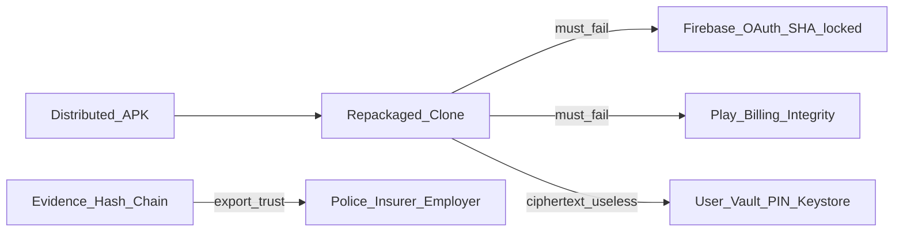

# MRP Anti-Clone & Client Hardening Plan

**Status:** Phase 1 audit doc started — full execution still gated on Play-signed AAB.  
**Strategy rating (review):** 9.8/10 with refinements below.  
**Overview:** Protect the user’s data first, then harden the APK as a separate layer. Raise clone/tamper cost and keep vault, accounts, and billing useless to imposters—without claiming reverse engineering is preventable or rewriting core logic into JNI.

**Baseline audit:** [`../security/SECURITY_AUDIT_HARDENING.md`](../security/SECURITY_AUDIT_HARDENING.md)

## Priority stack (execution order)

1. **Data security** — Drive vault, Android Keystore, EncryptedSharedPreferences, SQLCipher once schema is stable  
2. **Application hardening** — R8, release signing, debug/log removal (first-class; not optional fluff)  
3. **Integrity and detection** — signature / root / debug / Frida (best-effort), Play Integrity by policy, security events → risk → notify  
4. **Backend trust** — SHA-locked OAuth, App Check / licensing when Nest is live  
5. **Advanced defenses** — native helpers (fingerprint, security score, evidence hashing), signed rule packs  

**Mindset:** Attackers will eventually read Kotlin/JS. Objective is **increase cost**, not impossibility. Do **not** pin Google/Firebase/Drive TLS; pin only MRP’s own Nest API if/when required.

## Todos (when executing)

- [ ] Write security audit + threat model docs (baseline findings)
- [ ] Data layer: vault/Keystore review; schedule SQLCipher after schema freeze
- [ ] Evidence integrity: per-event SHA-256, hash chain, signed export, tamper events
- [ ] Enable R8, release keystore, disable hardcoded billing in release, RN minify/no maps
- [ ] SHA/package lockdown checklist for Firebase/Google/Play + cert check
- [ ] RuntimeIntegrityChecker → timeline `SECURITY_*` → risk bump → user notify
- [ ] Play Integrity gates per policy table (vault restore / recovery contacts / premium)
- [ ] Strip/gate sensitive and debug logs in release
- [ ] Introduce `RuleProvider` interface with `LocalRuleProvider` (signed remote later)
- [ ] Regression checklist + graphify update + remaining-risks writeup

## Goal (honest)

- **Do:** Protect timeline, selfies, recovery contacts, GPS history, Drive vault, and security reports; harden release APKs; detect and record integrity incidents; make casual clones fail at Google identity and billing.
- **Do not claim:** Stopping APK reverse engineering or defeating Frida/Magisk permanently.
- **Preserve:** All existing features. Soft policy for monitoring; hard Integrity only where the policy table says Yes.
- **Out of scope:** Full JNI rewrite of rule/score engines; Google/Firebase certificate pinning; unsigned remote rule downloads; Magisk/Shamiko arms race as success criteria; “zero client IDs in APK.”

## Threat model



**Assets (highest value):** user timeline, selfies, recovery contacts, GPS history, Google Drive vault, security reports / exported evidence.

## Play Integrity policy

| Feature | Integrity required |
|---------|-------------------|
| View timeline | No |
| Export evidence | Soft |
| Restore encrypted vault | Yes |
| Change recovery contacts | Yes |
| Premium subscription | Yes |

## Detect → log → respond

Instrumentation / environment signals must use MRP’s event model (not silent hard-kill of core monitoring):

```text
Frida / root / debugger / tamper detected
  → SECURITY_FRIDA_DETECTED (or SECURITY_ROOT / SECURITY_DEBUGGER / SECURITY_TAMPER / SECURITY_HOOK)
  → increase risk score
  → notify user
  → record incident (timeline + vault sync when enabled)
```

Wire through [`TimelineEventLogger`](../../MRP/android/app/src/main/java/com/mrp/domain/usecase/TimelineEventLogger.kt).

---

## Phase 1 — Audit and baseline (docs)

Produce `docs/security/SECURITY_AUDIT_HARDENING.md`:

- Hardcoded / env client IDs (Firebase, Maps fallback in [`build.gradle`](../../MRP/android/app/build.gradle), [`.env`](../../MRP/.env))
- ProGuard off (`enableProguardInReleaseBuilds = false`)
- Release signed with **debug** keystore today
- Verbose `Log.d` in camera/SIM/location paths
- EncryptedSharedPreferences for PIN/vault/SIM ([`PinLockModule`](../../MRP/android/app/src/main/java/com/mrp/PinLockModule.kt), [`DriveVaultModule`](../../MRP/android/app/src/main/java/com/mrp/DriveVaultModule.kt), [`SimRecoveryStorage`](../../MRP/android/app/src/main/java/com/mrp/data/local/SimRecoveryStorage.kt))
- Timeline SQLite not SQLCipher ([`TimelineStorage`](../../MRP/android/app/src/main/java/com/mrp/data/local/TimelineStorage.kt), [`EventDao`](../../MRP/android/app/src/main/java/com/mrp/data/local/EventDao.kt))
- Note: raise cost ≠ prevent RE; evidence trust ≠ APK obfuscation

## Phase 2 — Data security

1. Keep vault PIN + Keystore / EncryptedSharedPreferences as the primary confidentiality boundary.
2. **SQLCipher (or equivalent)** once the local schema is declared stable—timeline, GPS, app usage, selfie metadata, and recovery-related rows are sensitive. Not an R8 blocker, but **not postponed indefinitely**. Require migration + Drive backup compatibility plan before cutover.
3. Continue treating Drive vault ciphertext as useless without the user PIN.

## Phase 3 — Evidence cryptographic integrity (first-class)

Protects trustworthiness of data shared with police, insurers, or employers—distinct from APK hardening.

1. **Per-event SHA-256** over a canonical serialization of type, timestamp, location, and selected metadata.
2. **Hash chain:** `event_hash = H(prev_hash || payload)` stored with each timeline / `UnifiedEvent` row ([`EventDao`](../../MRP/android/app/src/main/java/com/mrp/data/local/EventDao.kt), [`TimelineEventLogger`](../../MRP/android/app/src/main/java/com/mrp/domain/usecase/TimelineEventLogger.kt)).
3. **Signed export packages** (Keystore-backed or PIN-derived key); verify on export and on web if exports are consumed there.
4. Broken chain or bad signature → `SECURITY_EVIDENCE_TAMPER` (+ notify).

Reuse existing SHA-256 patterns (e.g. vault PIN digest in [`DriveVaultSync`](../../MRP/android/app/src/main/java/com/mrp/domain/usecase/DriveVaultSync.kt)) as precedent.

## Phase 4 — Application hardening (first-class)

Files: [`build.gradle`](../../MRP/android/app/build.gradle), [`proguard-rules.pro`](../../MRP/android/app/proguard-rules.pro), RN metro/Hermes release config.

1. Enable R8 for release; keep rules for RN, Hermes, Firebase, CameraX, Billing, JSON bridges, `MrpNativeModule`.
2. Real **release** signing (keystore outside git). Stop shipping store builds with `signingConfigs.debug`.
3. `ALLOW_HARDCODED_BILLING=false` for release; debug/QA may keep hardcoded catalog.
4. RN release: minify JS, no source maps in shipped artifacts; disable dev menu / remote debugging.
5. Remove Maps API key source fallback; fail closed in release if env missing.

**Regression:** auth, Drive vault backup/restore, selfie, SIM path, billing mode=play smoke on release APK.

## Phase 5 — Anti-clone identity locks

1. Firebase / Google Cloud: OAuth and Android API keys restricted to `com.mrp` + **release** SHA-1/256.
2. Play Console: app signing + package ownership; billing SKUs only on this app.
3. Ops checklist: trademark / Play abuse reporting for PathSync/MRP clones.
4. Startup check: package + signing cert digest; mismatch → `SECURITY_TAMPER` (do not hard-crash debug builds).

## Phase 6 — Runtime integrity (detect → respond)

Module e.g. `com.mrp.security.RuntimeIntegrityChecker` on app/service start:

| Check | Event |
|-------|--------|
| Debuggable / debugger | `SECURITY_DEBUGGER` |
| Signing cert ≠ release digest | `SECURITY_TAMPER` |
| Basic root / emulator heuristics | `SECURITY_ROOT` / `SECURITY_EMULATOR` |
| Obvious hooks / Frida (best-effort) | `SECURITY_HOOK` / `SECURITY_FRIDA_DETECTED` |

Then: risk score ↑ → user notification → incident retained. Core monitoring stays up unless a later policy soft-limits vault restore / contact edit.

## Phase 7 — Play Integrity (policy gates)

1. Play Integrity API on actions marked Soft/Yes in the policy table.
2. Prefer server / Play-verified checks when Nest exists; until then soft UX (“unofficial install”) without bricking monitoring.
3. Align [`BillingModule`](../../MRP/android/app/src/main/java/com/mrp/BillingModule.kt)—clones must not unlock paid tiers locally.

## Phase 8 — Logging and PII hygiene

- Gate `Log.d` / `Log.v` behind `BuildConfig.DEBUG` on camera, SIM, location, vault paths.
- Release: minimal errors; no tokens, PIN, phone numbers, or GPS in logs.

## Phase 9 — RuleProvider foresight (no remote packs yet)

Introduce interface before remote rules exist:

```text
RuleProvider
  → LocalRuleProvider   (today: Misuse / DataRisk presets)
  → SignedRemoteRuleProvider  (future)
```

Refactor call sites in [`MisuseRuleEngine`](../../MRP/android/app/src/main/java/com/mrp/domain/usecase/MisuseRuleEngine.kt) / [`DataRiskRuleEngine`](../../MRP/android/app/src/main/java/com/mrp/domain/usecase/DataRiskRuleEngine.kt) to depend on the interface so a later signed pack does not force a rewrite. **Do not** ship unsigned remote rules.

## Phase 10 — Native helpers (advanced; not a wholesale rewrite)

Compact, security-sensitive algorithms only (later sprint):

- Device fingerprint generation  
- Security score calculation  
- Evidence hashing / chain step  
- Integrity / crypto helpers  

**Not** moved to JNI: full event engine, CameraX, Drive sync, RN bridges.

## Phase 11 — Explicitly deferred forever (or until product changes)

- Full business-logic JNI rewrite  
- Certificate pinning for Google / Drive / Firebase  
- Hard-block all rooted devices by default  
- Claiming RE or Frida is “solved”

## Deliverables when executed

1. Audit + threat model under `docs/security/`  
2. SQLCipher plan/migration when schema frozen; EncryptedSharedPreferences retained for secrets  
3. Evidence hash chain + signed export + tamper events  
4. Release builds with R8 + real signing + log hygiene  
5. Runtime integrity → risk → notify path  
6. Play/Firebase SHA lockdown + Integrity policy enforcement  
7. `RuleProvider` + local provider  
8. Regression results + `graphify update .` + remaining-risks writeup  

## Success criteria (realistic)

- User data confidentiality centered on vault + Keystore (+ SQLCipher when shipped)  
- Evidence exports verifiable via hash chain / signature  
- Release APK obfuscated; store builds not debug-signed  
- Hardcoded billing off in release; client IDs SHA-locked  
- Tamper/root/debug/Frida produce security events, risk bump, and user notify  
- Play Integrity enforced per policy table  
- Clone without your signing key cannot use your OAuth/Billing as you  
- All prior features still work on official release builds  
- Documented remaining risk: RE still possible; clone UX possible; Frida bypass possible  

## When to implement

1. Finish pending MRP Web work.  
2. With first Play-signed release AAB: Phases 4–5–8 (hardening + identity + logs).  
3. Nearby: Phase 2 SQLCipher (schema stable) + Phase 3 evidence integrity.  
4. Phases 6–7 with internal testing / billing.  
5. Phases 9–10 as follow-on without blocking store.
