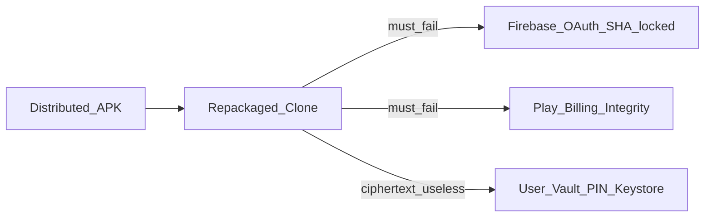

# MRP Anti-Clone & Client Hardening Plan

**Status:** Deferred — start after pending MRP Web work.  
**Overview:** Threat-model-first hardening for MRP Android: raise clone/tamper cost and keep vault/account/billing useless to imposters—without claiming reverse engineering is preventable or rewriting core logic into JNI.

## Todos (when executing)

- [ ] Write security audit + threat model docs (baseline findings)
- [ ] Enable R8, release keystore, disable hardcoded billing in release, RN minify/no maps
- [ ] SHA/package lockdown checklist for Firebase/Google/Play + optional cert check
- [ ] RuntimeIntegrityChecker → TimelineEventLogger security events (soft policy)
- [ ] Play Integrity soft gate on billing/entitlement/sensitive restore
- [ ] Strip/gate sensitive and debug logs in release
- [ ] Deferred: SQLCipher/hot-path encryption evaluation
- [ ] Regression checklist + graphify update + remaining-risks writeup

## Goal (honest)

- **Do:** Make casual APK clones fail at Google identity, billing, and vault access; detect tamper/root/debug and log security events; ship obfuscated production builds with clean logs.
- **Do not claim:** Stopping APK reverse engineering or defeating Frida/Magisk permanently.
- **Preserve:** All existing features; soft policy only (detect + timeline event; hard-block only for billing/restore/sensitive gates where Play requires it).
- **Out of scope for this plan:** Full JNI rewrite of rule/score engines, Google/Firebase certificate pinning, unsigned remote rule downloads, Magisk/Shamiko arms race as success criteria.

## Threat model (what we defend)

## Phase 1 — Audit & baseline (docs only)

Produce `docs/security/SECURITY_AUDIT_HARDENING.md` covering:

- Hardcoded / env client IDs (Firebase, Maps fallback in [`MRP/android/app/build.gradle`](../../MRP/android/app/build.gradle), [`.env`](../../MRP/.env))
- ProGuard off (`enableProguardInReleaseBuilds = false`)
- Release signed with **debug** keystore today
- Verbose `Log.d` in camera/SIM/location paths
- EncryptedSharedPreferences already used for PIN/vault/SIM ([`PinLockModule.kt`](../../MRP/android/app/src/main/java/com/mrp/PinLockModule.kt), [`DriveVaultModule.kt`](../../MRP/android/app/src/main/java/com/mrp/DriveVaultModule.kt), [`SimRecoveryStorage.kt`](../../MRP/android/app/src/main/java/com/mrp/data/local/SimRecoveryStorage.kt))
- Timeline SQLite not SQLCipher ([`TimelineStorage.kt`](../../MRP/android/app/src/main/java/com/mrp/data/local/TimelineStorage.kt))
- Event sink: [`TimelineEventLogger.kt`](../../MRP/android/app/src/main/java/com/mrp/domain/usecase/TimelineEventLogger.kt)

Also: short threat model + reverse-engineering mitigation note (raise cost ≠ prevent).

## Phase 2 — Build & release hardening

Files: [`MRP/android/app/build.gradle`](../../MRP/android/app/build.gradle), [`proguard-rules.pro`](../../MRP/android/app/proguard-rules.pro), RN metro/Hermes release config.

1. Enable R8 for release (`minifyEnabled true`); populate ProGuard keep rules for RN, Hermes, Firebase, CameraX, Billing, Gson/JSON bridges, `MrpNativeModule` / TurboModule surfaces.
2. Add real **release** signing config (keystore outside git; CI secrets). Stop shipping release with `signingConfigs.debug`.
3. Force `ALLOW_HARDCODED_BILLING=false` for release; keep debug/QA free to use hardcoded catalog.
4. RN release: minify JS, **no source maps** in shipped artifacts; ensure dev menu / remote debugging disabled in release.
5. Remove Maps API key **source fallback** string; fail closed if env missing in release.

**Regression:** install release APK; auth, Drive vault backup/restore, camera selfie, SIM path, billing mode=play path smoke.

## Phase 3 — Anti-clone identity locks (console + light code)

Not mostly code—configuration:

1. Firebase / Google Cloud: OAuth clients and Android API keys restricted to `applicationId` `com.mrp` + **release** SHA-1/256 only.
2. Play Console: app signing + package ownership; billing SKUs only on this app.
3. Document trademark / Play abuse reporting for PathSync/MRP clones (ops checklist, not code).

Optional light code: startup check that package name is `com.mrp` and signing cert matches expected release digest; on mismatch log security event (Phase 4). Do **not** hard-crash the whole app on debug builds.

## Phase 4 — Runtime integrity (detect → timeline)

New Kotlin module e.g. `com.mrp.security.RuntimeIntegrityChecker` called once from app/service start:

| Check | Action |
|-------|--------|
| Debuggable / debugger | Log `SECURITY_DEBUGGER` |
| Signing cert ≠ release digest | Log `SECURITY_TAMPER` |
| Basic root / emulator heuristics | Log `SECURITY_ROOT` / `SECURITY_EMULATOR` |
| Obvious hook indicators (best-effort) | Log `SECURITY_HOOK` |

Wire through existing [`TimelineEventLogger.logEvent`](../../MRP/android/app/src/main/java/com/mrp/domain/usecase/TimelineEventLogger.kt). **Policy default: warn + event only** (no feature kill). Later policy may soft-limit vault restore / contact edit if desired.

## Phase 5 — Play Integrity (soft gate)

1. Add Play Integrity API dependency; request token on sensitive actions: Play purchase restore, entitlement refresh, optional vault restore.
2. Prefer **server or Play-verified** path when Nest/Firebase functions exist; until then client can record verdict + soft UX (“unofficial install”) without bricking core monitoring.
3. Align with [`BillingModule.kt`](../../MRP/android/app/src/main/java/com/mrp/BillingModule.kt) / entitlement cache—clones must not unlock paid tiers locally.

## Phase 6 — Logging & PII hygiene

- Gate `Log.d`/`Log.v` behind `BuildConfig.DEBUG` (or Timber tree) across native hot paths (camera, SIM, location, vault).
- Release: errors only, no tokens, PIN, phone numbers, GPS in logs.

## Phase 7 — Storage follow-up (later sprint)

- Keep EncryptedSharedPreferences for secrets.
- Evaluate SQLCipher or page-level encryption for highest-value local tables only if audit shows plaintext timeline/contacts as unacceptable residual risk—**migration plan + backup compatibility required**; not Phase 2 blocker.

## Phase 8 — Explicitly deferred

- Moving Misuse/DataRisk/security score engines into JNI
- Remote unsigned rule packs
- Certificate pinning for Google/Drive/Firebase
- Hard-block all rooted devices
- “Zero client IDs in APK”

## Deliverables when executed

1. Security audit + threat model docs under `docs/security/`
2. Release builds with R8 + real signing
3. Runtime integrity events in timeline
4. Play/Firebase SHA lockdown checklist completed
5. Soft Play Integrity on billing/sensitive paths
6. Regression checklist results (auth, timeline, GPS, SIM, selfie, Drive, queue, workers)
7. `graphify update .` after code changes
8. Remaining-risks section: RE still possible; clone UX possible; Frida bypass possible

## Success criteria (realistic)

- Release APK obfuscated; debug keystore not used for store builds
- No private server secrets in repo/APK; client IDs SHA-locked
- Hardcoded billing disabled in release
- Tamper/root/debug produce timeline security events
- Clone without your signing key cannot use your OAuth/Billing as you
- All prior features still work on official release builds

## When to implement

Start after pending MRP Web work, ideally with the first Play-signed release AAB (R8 + real keystore + SHA locks). Soft Play Integrity after billing/Play track is real.
