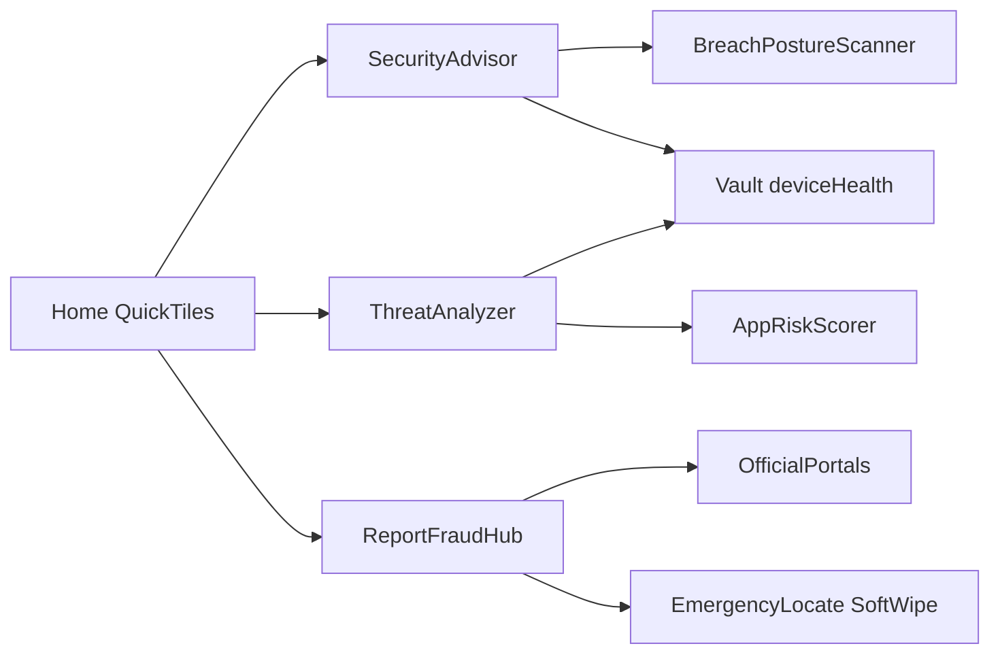

# MRP Security Center — feature backlog

**Status:** Saved plan — **implement after web portal changes** (do not start coding this track yet).  
**Last updated:** 2026-08-01

**MRP inventory baseline:**

- [HomeScreen.tsx](../../MRP/src/features/home/HomeScreen.tsx)
- [AppSafetyScreen.tsx](../../MRP/src/features/app-usage/AppSafetyScreen.tsx)
- [BreachPostureScanner.kt](../../MRP/android/app/src/main/java/com/mrp/domain/usecase/BreachPostureScanner.kt)
- [AppRiskScorer.kt](../../MRP/android/app/src/main/java/com/mrp/domain/usecase/AppRiskScorer.kt)
- [DataRiskRuleEngine.kt](../../MRP/android/app/src/main/java/com/mrp/domain/usecase/DataRiskRuleEngine.kt)
- Hub / Drive / panic / SIM / geofence / web locate

MRP today is **Watch → Capture → Sync → Review** (anti-theft evidence + Drive vault + PathSync console). This backlog adds **advise / scan / report** surfaces that fit that model — local posture and user action, without cloud malware engines or vault-on-server.

---

## Feature areas

### A. Security Advisor

Target checks: lock-screen notifications, developer options, USB debugging, root, hotspot, secure Wi‑Fi, Wi‑Fi proxy, VPN, Play Protect, wireless debugging.

**MRP already:** developer options, USB debugging, unknown admins, accessibility, battery exemption, notifications (`BreachPostureScanner` + App Safety UI).

**Add to MRP:**

- Root / Magisk-style detection
- Hotspot active status (beyond hotspot *event* monitoring)
- Wi‑Fi encryption grade (open / WEP / WPA2 / WPA3)
- System proxy configured
- VPN active
- Play Protect enabled (via available Play Protect / Integrity APIs)
- Wireless debugging (ADB over network)
- Lock-screen notification sensitivity
- Dedicated **Security Advisor** screen (expand App Safety checklist with clear status pills)

### B. Report Fraud

India-centric action hub: cybercrime, fraud calls/SMS, lost mobile block/track, UPI fraud, bank escalation, digital arrest safety, women safety, Aadhaar fraud, USSD/MMI (call-forwarding codes).

**MRP already (partial):** panic SMS, SIM recovery, emergency locate via Drive + PathSync — **not** a report hub.

**Add to MRP:**

- **Report Fraud hub** (deep links / WebView to official portals) — mostly **no backend**, high value, low privacy risk
- Lost-mobile tile → existing Find my device / emergency tracking + soft wipe (bridge, don’t rebuild)
- USSD/MMI helper: call-forwarding check codes (`*#21#`, `*#62#`, etc.) + one-tap dial intent
- Women safety / emergency: expand panic + recovery contacts
- Digital-arrest education card (static content + report deep links)

### C. Threat Analyzer

Donut overview + Full Scan + Malicious / Likely Risky / Likely Non-Risky counts.

**MRP already:** `AppRiskScorer`, install/update risk events, sensitive permission sections, sideload awareness — **no** analyzer UI or donut.

**Add to MRP:**

- **Threat Analyzer UI** on top of existing heuristic scorer (counts + donut + “Start full scan”)
- Hidden / sideloaded app list (expose scorer signals as a list)
- Stale-app update warnings (“not updated in N months”)
- Adware heuristic flags (aggressive ads / overlay + install source)
- Persist last scan summary into vault `deviceHealth` for PathSync overview

Do **not** claim antivirus / Play Protect replacement; keep “local heuristic” copy.

### D. Home Quick Tiles

Security rating + tiles: Scan QR, Wi‑Fi Security, Scan Website, OTP Security, Data Breach, App Permissions.

**MRP already:** Home security %, Wi‑Fi SSID tile, App Permissions screens, App Safety.

**Add to MRP:**

- Home **Quick Tiles** row (QR / URL / Wi‑Fi grade / OTP tips / breach check / permissions)
- QR check (decode → URL → same URL scanner)
- URL / website reputation check (local blocklist + optional Safe Browsing; prefer on-device + user-paste)
- Wi‑Fi security grade tile (same as Advisor)
- OTP vigilance: SMS OTP keyword heuristics / overlay-while-OTP warning (privacy-careful)
- Data breach: email/phone check (**user-initiated only**; never send vault data)
- Social-media account enumeration on email — skip for v1

---

## Full candidate feature list

### Tier 1 — High fit (privacy-safe, reuses core)

1. Expand **Security Advisor** checklist (root, VPN, proxy, hotspot, Wi‑Fi crypto, Play Protect, wireless ADB, lock-screen notifs)
2. **Threat Analyzer** UI over `AppRiskScorer` (scan + categories + donut)
3. Sideloaded / hidden-app inventory UI
4. Stale-update app warnings
5. **Report Fraud** hub (official deep links + education)
6. USSD call-forwarding checker
7. Quick tile: Wi‑Fi security grade
8. Quick tile / tool: URL paste scanner
9. Quick tile: QR → URL scanner
10. Surface emergency locate + soft wipe under “Lost mobile” in Report Fraud
11. Sync Advisor / Analyzer summary into Drive vault for web overview

### Tier 2 — Valuable but careful

12. User-initiated **data-breach email check** (external API, consent, no auto-scan of contacts)
13. OTP/SMS scam heuristics (timeline event, not cloud OTP storage)
14. Adware scanner heuristics
15. Women-safety preset (panic + contacts + SOS copy)
16. Multilingual EN/HI for Advisor + Fraud hub

### Tier 3 — Weak fit / avoid or defer

17. Blockchain app-verifier ledger — out of scope unless partnered
18. Continuous commercial AV / cloud signature DB
19. Paid social-media enumeration products
20. Expert stories / content feed (unless marketing wants it)
21. Replacing PathSync with a score-only consumer shell (wrong product)

---

## Recommended first implementation slice (after web portal)

Ship a **Security Center** hub on mobile that wraps existing App Safety + new gaps, without Nest vault access:

**Phase 1:**

- Extend `BreachPostureScanner` with missing Advisor checks + polish App Safety (or new `SecurityAdvisorScreen`)
- New Threat Analyzer screen driven by `AppRiskScorer` + package inventory
- New Report Fraud screen: deep links + Lost Mobile → existing emergency/panic flows
- Home quick tiles linking to the three

**Phase 2:** URL + QR scanners; Wi‑Fi grade; USSD helper; vault summary fields.

**Phase 3:** Breach email check; OTP heuristics; HI locale; adware/stale-update polish.

---

## Architecture / product constraints

- Keep **encrypted Drive vault** as locate/evidence store; do not put fraud reports or breach emails on MRP servers
- Mark heuristic scans as **not antivirus**
- Prefer **deep links to official portals** over collecting fraud case data
- After UI/docs structure changes: `graphify update .`

---

## Scheduling

| Order | Work |
|-------|------|
| Now | Web portal changes (current track) |
| Next | Implement this Security Center backlog (Phase 1 → 3) |

Do not start Security Center implementation until web portal work is complete enough to hand off.
