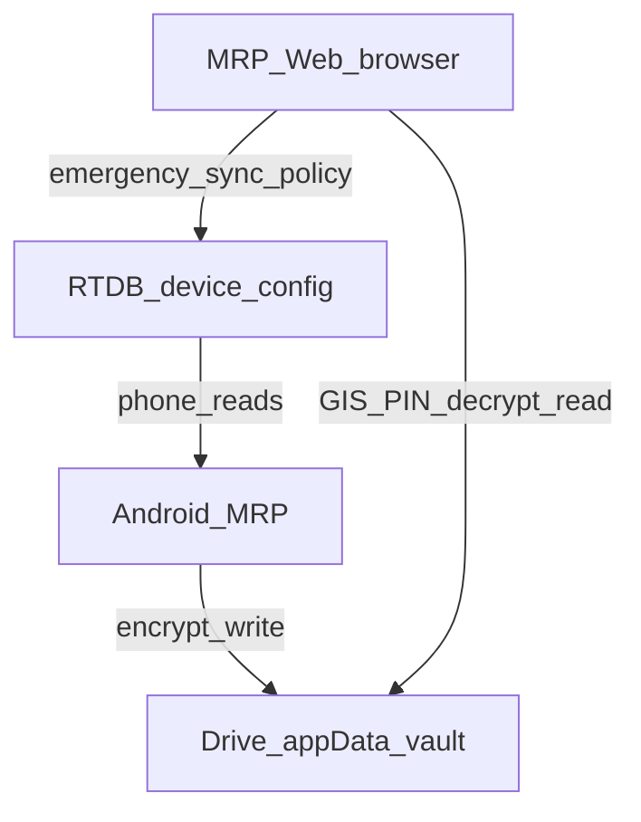

# MRP Web Portal — Feature Parity Plan (refined)

**Status:** Implemented (W0–W6 code landed 2026-07-31). Deploy Hosting when approved.  
**Overview:** Drive-vault desktop companion with near-parity for read/visualize/control surfaces, plus orientation-safe resilient UI, soft client anti-abuse, API/traffic controls, and performance—without claiming DevTools can be fully blocked in a browser.

## Todos (when implementing)

- [x] W0: VaultSessionProvider, typed selectors, shell/header IA, ErrorBoundaries
- [x] W1: Enterprise dashboard + vault/device health status
- [x] W2: MapLibre map, travel history, geofence read-only overlay
- [x] W3: Rich timeline, detail drawer, selfie media gallery
- [x] W4: App Usage charts/filters parity from vault v3
- [x] W5: Global search + report exports CSV/Excel
- [x] W6: Orientation/responsive, soft anti-inspect, CSP/API traffic, speed (build OK; Hosting deploy pending approval)

## Honest goal (replace “100% parity”)

Make [MRP Web](../../MRP%20Web/) the **desktop companion** for PathSync/MRP: same **data plane** as the phone’s encrypted Drive vault, premium UX, and remote **control** that already exists (`device_config` emergency / sync policy).

**Not** a clone of Android background services. Success = “feels like the desktop edition of the vault + locate console,” not “every Monitoring toggle runs in the browser.”

Preserve: Firebase Auth, Drive `appDataFolder` decrypt-in-browser, RTDB `device_config` only, Nest optional, Circle **off** (`CIRCLE_ENABLED` / join landing disabled).

## Architecture constraints (do not violate)

- **Phone is the vault writer.** Web is primarily **read + visualize + policy**.
- Geofence **CRUD**, monitoring toggles, panic SMS, SIM SMS, selfie capture, permissions, Play billing, UsageStats = **device-only** (show read-only / deep-link “open on phone” where useful).
- No restoring `device_live` / plaintext location to Firebase (Drive-only v1).

## Map engine (locked default)

**Interactive MapLibre GL JS (or Leaflet) + OSM tiles** inside the app for polylines, clustering, geofence circles, playback.

- Keep “Open in Google Maps” external links (already in [`VaultMap.tsx`](../../MRP%20Web/src/components/VaultMap.tsx)).
- **Do not** mandate Google Maps JavaScript API for v1 parity (billing, CSP, key lockdown). Revisit only if product explicitly funds Maps Platform later.
- Replace single-point OSM **iframe** with a real map component used across Live / Travel / Timeline / Geofence.

## Current baseline → target IA

**Today** ([`AppShell.tsx`](../../MRP%20Web/src/components/AppShell.tsx)): Overview, Locate & Timeline, App Usage, Devices, Reports, Sync policy, Admin.

**Target nav (grouped, not 20 top-level CRUD links):**

| Group | Routes | Notes |
|-------|--------|-------|
| Overview | `/dashboard` | Enterprise dashboard from vault + policy |
| Locate | `/monitoring` (live + timeline), `/travel`, `/map` | Travel/map may be tabs under monitoring first |
| Evidence | `/timeline` or monitoring tab, `/media` | Rich timeline + selfie gallery |
| Insights | `/app-usage`, `/reports` | Charts + exports |
| Places | `/geofences` | **Read-only** from `vault.geofences` + timeline enter/exit |
| Account | `/settings`, `/profile`, `/devices` | Sync policy, account, vault status |
| Admin | `/admin` | Unchanged privilege model |

Header: PathSync / MRP branding upgrade on existing theme tokens ([`globals.css`](../../MRP%20Web/src/app/globals.css) field/slate/dawn)—sticky shell, subtle motion, a11y. Avoid generic purple glass / AI-template look; extend PathSync visual language.

## Missing pieces added to the original brief

| Gap | Plan |
|-----|------|
| Re-enter PIN every page | Shared **`VaultSessionProvider`**: unlock once per tab session; share decrypted payload across pages |
| Unused vault fields | Surface `geofences`, `version`, `createdAtMs`, `syncReason`, `pendingSync`, full `deviceHealth` |
| No travel module | Derive routes from timeline GPS points (date range filters, distance/time heuristics client-side) |
| Weak map | MapLibre: live marker, day polyline, playback, geofence overlays, selfie/event markers |
| Timeline UX | Severity icons, filters, detail drawer (map + selfie zoom/download/prev-next) |
| Selfie gallery | Grid/list, event filter, keyboard nav, metadata + map preview (beyond max-24 dump) |
| App Usage | Daily summary charts, sort/filter, risk/safety already partial—match mobile dashboard depth from vault |
| SIM | Dedicated read-only SIM history section (data already on monitoring) |
| Security score | Client-computed score/risk from vault events + `deviceHealth` (display only; phone remains source of monitoring) |
| Global search | Client search over unlocked vault (events, apps, places, selfie meta) |
| Reports | CSV now; add Excel; PDF later if needed—Travel / Security / Usage / Geofence summaries from vault |
| Profile / vault status | Last backup age, vault version, sync reason, emergency state |
| Empty/error/skeleton | Consistent loading and empty states (premium, not blank tables) |
| Performance | Virtualize long timelines; lazy routes; thumbnail decode limits; cache decrypted session |
| Orientation / any device | Portrait + landscape; phone/tablet/desktop/ultrawide; no broken layouts on rotate |
| UI never hard-fails | React error boundaries, route fallbacks, vault decrypt failure UX, map load failure |
| Soft anti-abuse | Context-menu off on sensitive surfaces; DevTools detect→warn (not “disable inspect”) |
| API traffic / tamper | CSP, auth on writes, client rate limits, no vault plaintext to Nest, validate RTDB payloads |
| Evidence integrity (future) | When mobile ships hash-chain ([`ANTI_CLONE_HARDENING.md`](ANTI_CLONE_HARDENING.md)), web **verify** on export |
| pathsync.in | Ops: DNS → Firebase Hosting (A → `199.36.158.100` + ACME TXT) |
| Circle / Subscriptions UI | **Out of v1 web parity** (Circle flagged off; billing is Play/admin notes only) |

## Explicit non-goals (v1 web)

- Background monitoring engine, panic/SIM SMS send, camera capture, OS permissions, Play purchase sheet
- Geofence create/edit/delete on web (phone remains editor; web visualizes)
- Live WebSocket location stream (Drive snapshot + emergency refresh remains the model)
- Admin vault decrypt for other users
- Full Google Maps Platform feature list (traffic/street view SDK)
- Framer-Motion-everywhere / glassmorphism-as-identity
- **Guaranteeing** DevTools / inspect / right-click are impossible (browsers cannot fully enforce this)

## Device orientation, resilient UI, soft anti-abuse, API traffic, speed

### Orientation and layout (must not break)

- Fluid layout for portrait and landscape; safe-area insets (notch); min touch targets ≥44px on mobile.
- Shell: collapsible nav on narrow + landscape phones; map/timeline split stacks vertically when height is short.
- CSS: avoid fixed heights that clip on rotate; `dvh`/`svh` where needed; test 320px–1440px and 90° rotation.
- Maps: `resize()` on orientation/`visualViewport` change so MapLibre never leaves a blank canvas.
- Images/selfies: `object-fit` + max-width; no horizontal page overflow.

### UI never hard-fails

- App-level + route-level **React Error Boundaries** with recovery (“Retry”, “Relock vault”, “Sign out”)—never a white screen.
- Vault unlock / GIS / Drive fetch: typed error states (wrong PIN, no backup, offline, quota)—no uncaught promise crashes.
- Map tile / worker failure: fallback list view + “Open in Google Maps” link.
- Suspense/skeletons for slow decrypt; toast for non-fatal errors.
- Defensive rendering: missing timeline fields, omitted selfies, empty geofences—empty states, not runtime throws.

### Right-click and inspect tools (honest soft layer)

Browsers cannot securely disable DevTools. Plan includes **deterrence only**, not a security boundary:

| Control | Behavior |
|---------|----------|
| Context menu | `contextmenu` preventDefault on vault/selfie/timeline surfaces (allow on inputs/links where needed for a11y) |
| Shortcut friction | Optionally intercept common DevTools chords in production (F12, Ctrl+Shift+I/J/C)—**easily bypassed** |
| DevTools detection | Heuristic (debugger timing / window size delta): show banner “Secure session — inspection detected”; optional auto **relock vault** (clear plaintext from memory) |
| Production build | Minified Next export; no source maps on Hosting; strip console in prod |
| Do not | Break accessibility keyboard use; do not claim “inspect disabled” |

True confidentiality remains: **PIN + vault crypto + session clear on lock/visibility policies**—not hiding HTML.

### API traffic and data tampering

Client-visible vault plaintext after unlock is inherent. Controls that matter:

- **CSP** (extend [`firebase.json`](../../MRP%20Web/firebase.json)): strict `script-src` / `connect-src` (Firebase, GIS, Drive, MapLibre tiles/workers, Nest if used); `object-src 'none'`; no unexpected third parties.
- **Writes:** only authenticated Firebase `device_config` / admin paths; server rules already deny vault bytes—keep it that way.
- **Client rate limit** Find-my-device / policy PATCH (debounce + cooldown) to avoid accidental/abusive RTDB spam.
- **Request hygiene:** abort controllers, timeout, no retry storms; Nest `api.ts` never sends vault plaintext.
- **Input validation** before RTDB writes (schema/allowlist fields).
- **Integrity:** when evidence hash-chain exists, verify before export; treat UI-edited JSON as untrusted.
- **Session:** clear decrypted vault on sign-out, tab close (best-effort `beforeunload`), optional idle timeout, optional relock when DevTools heuristic fires.
- **Transport:** HTTPS only (Hosting); no mixed content.

### Speed

- Route-level `dynamic()` imports for map/charts/gallery.
- Virtualize long timeline/selfie lists; paginate reports.
- Decode/display selfie thumbs lazily; cap concurrent image decodes.
- Memoize travel geometry derived from timeline; avoid full re-decrypt on navigation (session cache).
- Prefetch next route; cache Drive blob ETag/If-None-Match if API allows.
- Measure: LCP shell < ~2.5s on mid desktop; timeline scroll 60fps target for 1k rows via virtualization.
- Bundle: tree-shake MapLibre; avoid duplicate icon packs.

## Phased delivery

### W0 — Foundation

- `VaultSessionProvider` + unlock gate reused by dashboard/monitoring/usage/reports/media
- Typed selectors over [`VaultPayload`](../../MRP%20Web/src/lib/vault-crypto.ts) (timeline, live, selfies, sim, health, geofences, appUsage)
- Shell IA + header polish on existing themes
- Root **ErrorBoundary** + unlock error UX
- Graphify query baseline before coding

### W1 — Dashboard + vault status

- Security score / risk / today’s activity / live tile / health / geofence summary / usage teaser / recent selfies / alerts / quick actions (Find my device, open timeline, unlock vault)
- Data from unlocked vault + `device_config` (no mocks)

### W2 — Map + travel + geofence view

- MapLibre map module replacing iframe [`VaultMap`](../../MRP%20Web/src/components/VaultMap.tsx)
- Live location panel; travel history by date range; polyline + playback; stop detection heuristics
- Geofence list + map overlay from `vault.geofences` + enter/exit from timeline

### W3 — Security timeline + detail + media

- Redesigned timeline (filters, severity, selfie thumbs, SIM/app fields)
- Detail drawer/modal with map, metadata, selfie lightbox (zoom, download, prev/next)
- `/media` gallery (grid/list, filters, lazy load)

### W4 — App Usage depth

- Charts, most-used, duration sort/filter, safety sections parity with mobile vault v3 fields
- Link sessions to timeline where IDs/times align

### W5 — Reports + search + exports

- Global search over session vault
- Report builders (travel/security/usage/geofence/daily) → CSV + Excel; PDF optional follow-on
- Preserve current timeline CSV

### W6 — Polish, resilience, soft anti-abuse, API traffic, speed, deploy

- Orientation + responsive matrix (phone/tablet/desktop × portrait/landscape); map resize on rotate
- Error boundaries, empty/error/skeleton/toast consistency; a11y (keyboard still works where context menu blocked)
- Soft anti-abuse: contextmenu off on sensitive views; optional shortcut friction; DevTools heuristic → warn + vault relock
- Production: no source maps on Hosting; minify; strip debug logs
- CSP + MapLibre `worker-src` / tile `connect-src`; client rate limits on policy writes; idle/session clear
- Perf: code-split, virtualize, lazy thumbs, session cache; speed check on mid hardware
- Theme polish (field/slate/dawn)
- Regression + screenshots + `graphify update` + Hosting deploy

## Design / UX guardrails

- One composition per viewport; PathSync brand hero on marketing/landing only; console = dense but calm enterprise
- Prefer existing CSS variables over new purple/cream AI themes
- Motion: 2–3 purposeful transitions (page shell, map marker, drawer)—not flashy
- Cards only where they aid interaction (dashboard tiles, event rows)
- Layout must survive orientation change without horizontal scroll or clipped controls

## Testing (must pass)

Auth; vault unlock once → multi-page; dashboard; live + travel map; timeline detail + selfie; app usage; geofence overlay; reports export; search; themes; **portrait + landscape** on narrow and wide; **forced React error** recovers via boundary; Find-my-device policy write rate-limited; no vault bytes to Nest; Circle still disabled; production build has no public source maps; context menu blocked on selfie/timeline without breaking text inputs.

## Deliverables

1. This living plan doc
2. Files / routes / components / services list per phase
3. Graphify before/after
4. Manual test results + before/after screens (incl. orientation)
5. Remaining gaps table (device-only + deferred Google Maps SDK / PDF / geofence write + DevTools limits)

## Success criteria (realistic)

- Desktop companion UX for vault-backed features; not a thin CSV site
- Interactive maps + travel + rich timeline + media + usage + geofence **view**
- Shared vault session; no mock data
- UI survives orientation change and recoverable errors (no white-screen death)
- Soft anti-abuse + CSP + traffic controls shipped; **no false claim** that inspect is impossible
- Fast enough under virtualization targets; architecture preserved (Drive-only, phone writer)
- Existing auth/policy/admin still work; Graphify updated
- Documented non-parity for device-only, Circle/billing, and browser DevTools reality
